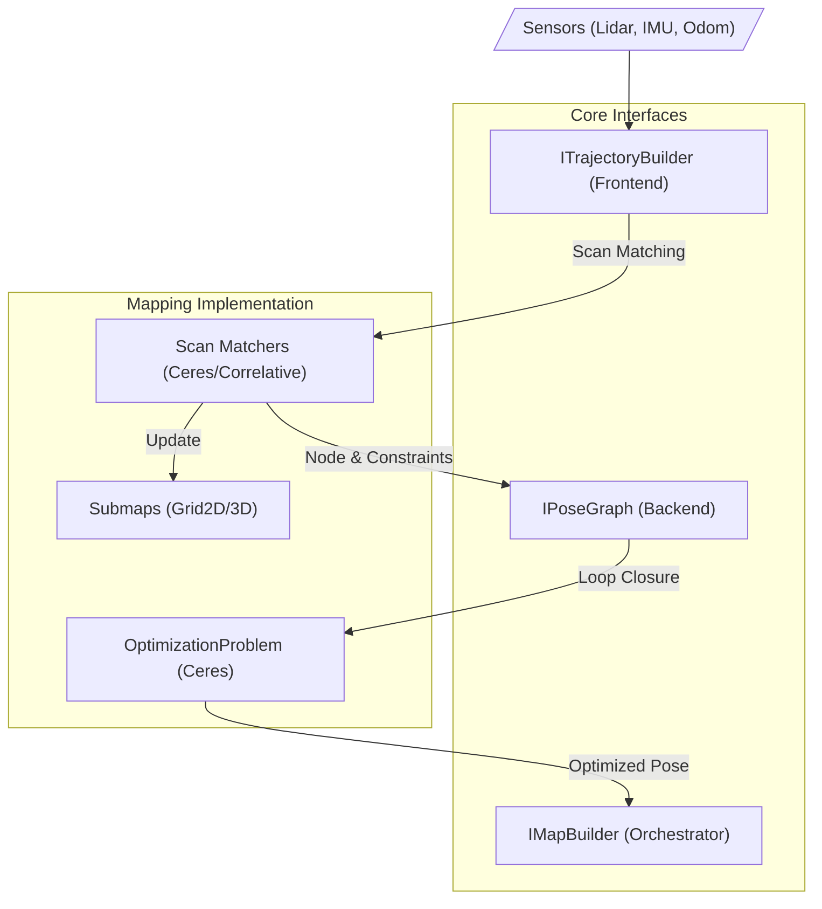

# Đánh Giá Chi Tiết Source Code CartographerSharp

## 1. Tổng Quan
**CartographerSharp** là một bản port (chuyển đổi) đầy đủ và trung thành của hệ thống Google Cartographer sang ngôn ngữ C# (.NET 10.0). Dự án được cấu trúc bài bản, thể hiện sự hiểu biết su sắc về cả thuật toán SLAM và các tính năng hiện đại của .NET.

### Điểm Nổi Bật
- **Technology Stack**: Sử dụng .NET 10.0 (Preview), tối ưu hiệu năng.
- **Dependency**: Tích hợp chặt chẽ với `CeresSharp` cho các bài toán tối ưu phi tuyến.
- **Kiến Trúc**: Giữ nguyên mô hình Frontend-Backend mạnh mẽ của bản gốc.
- **Tính Năng**: Hỗ trợ đầy đủ các thuật toán Scan Matching (Real-time Correlative, Fast Correlative, Ceres Scan Matcher).

## 2. Kiến Trúc Hệ Thống

Hệ thống tuân theo kiến trúc module hóa cao, tách biệt rõ ràng giữa việc xử lý dữ liệu cảm biến (Local SLAM) và tối ưu hóa toàn cục (Global SLAM).

### Luồng Dữ Liệu (Data Flow)

1.  **Input**: Dữ liệu từ Lidar, IMU, Odometry được đưa vào qua `ITrajectoryBuilder`.
2.  **Frontend (Local SLAM)**: 
    - `LocalTrajectoryBuilder2D` xử lý dữ liệu thô.
    - `VoxelFilter` lọc nhiễu và giảm kích thước dữ liệu.
    - `ScanMatching` (sử dụng `CeresScanMatcher2D` hoặc `RealTimeCorrelativeScanMatcher2D`) tìm vị trí robot cục bộ bằng cách khớp với Submap hiện tại.
    - Kết quả là một `Node` mới trong đồ thị quỹ đạo.
3.  **Backend (Global SLAM)**:
    - `PoseGraph2D` quản lý đồ thị các pose.
    - Khi phát hiện Loop Closure (quay lại chốn cũ), `ConstraintBuilder` sẽ tạo ràng buộc mới.
    - `OptimizationProblem2D` sử dụng `CeresSharp` để giải bài toán tối ưu toàn cục, giảm sai số tích lũy.

## 3. Phân Tích Cấu Trúc Mã Nguon

Thư mục `srcs\RobotNet10\RobotApp\Communication\CartographerSharp` được tổ chức rất rõ ràng:

| Thư mục | Vai trò | Chi tiết |
|---------|---------|----------|
| `Mapping` | **Core Logic** | Chứa `MapBuilder`, `PoseGraph` và các interface chính. |
| `Mapping/Internal` | **Implementation** | Các thuật toán chi tiết, ẩn giấu khỏi API public. |
| `Mapping/Internal/2D/ScanMatching` | **Thuật toán SLAM** | Chứa `FastCorrelativeScanMatcher`, `CeresScanMatcher` - trái tim của Local SLAM. |
| `Sensor` | **Data Types** | `PointCloud`, `ImuData`, `OdometryData`, `VoxelFilter`. |
| `IO` | **Serialization** | Đọc/Ghi file `.pbstream` (tương thích Protocol Buffers). |
| `Common` | **Utilities** | Math helpers, Time conversion. |

## 4. Đánh Giá Chất Lượng Code

### Ưu Điểm
1.  **Modern C#**: Sử dụng các tính năng mới nhất của C# như `record`, `nullable reference types`, `System.Text.Json`.
2.  **Hiệu Năng**: 
    - Sử dụng `unsafe` code block ở những nơi cần thiết (ví dụ: thao tác pointer trong xử lý ảnh hoặc math loop) để đạt hiệu năng gần với C++.
    - Sử dụng `System.Numerics.Vector3` để tận dụng SIMD.
3.  **Clean Code**:
    - Tên biến và hàm rõ nghĩa, tuân thủ chuẩn naming convention của C#.
    - Comments đầy đủ, đặc biệt là các phần thuật toán phức tạp (như trong `VoxelFilter.cs`).
4.  **Tương Thích**:
    - Hệ thống Serialization/Deserialization qua ProtoBuf đảm bảo có thể load/save map tương thích với các tool khác trong hệ sinh thái Cartographer.

### Nhược Điểm / Cần Lưu Ý
1.  **Độ Phức Tạp Cao**: Do port từ C++ nên một số cấu trúc (như `Delegate` hay `Callback`) có thể hơi phức tạp đối với người mới làm quen C# thuần túy.
2.  **Dependency**: Phụ thuộc vào native library `Ceres Solver` (thông qua `CeresSharp`). Việc deploy cần đảm bảo có đủ native binaries cho OS tương ứng (Windows/Linux).

## 5. Chi Tiết Các Component Quan Trọng

### 5.1. Scan Matching (`Mapping/Internal/2D/ScanMatching`)
Đy là phần ấn tượng nhất. Source code đã implement đầy đủ:
- **`RealTimeCorrelativeScanMatcher2D`**: Dùng cho local slam nhanh, tìm kiếm trong cửa sổ nhỏ.
- **`FastCorrelativeScanMatcher2D`**: Dùng cho Loop Closure, tìm kiếm trên toàn map sử dụng Branch & Bound.
- **`CeresScanMatcher2D`**: Tinh chỉnh pose (refinement) với độ chính xác sub-pixel.

### 5.2. Pose Graph (`Mapping/PoseGraph.cs`)
- Implement logic `Trimmer` để giới hạn kích thước map (xóa bớt submap cũ nếu cần).
- Xử lý đa luồng (Multi-threading) cho việc tính toán Constraint (rất quan trọng cho hiệu năng Real-time).

## 6. Kết Luận
Source code `CartographerSharp` là một tài sản giá trị, chất lượng cao. Nó không chỉ là một wrapper đơn giản mà là một bản implement thực sự của các thuật toán SLAM phức tạp trên nền tảng .NET.

**Khuyến nghị**:
- Nên duy trì unit test (nếu có) để đảm bảo tính đúng đắn khi nng cấp .NET version.
- Cần chú ý phần `Interop` với `CeresSharp` khi deploy lên các môi trường khác nhau (Docker, Linux ARM64, v.v.).
