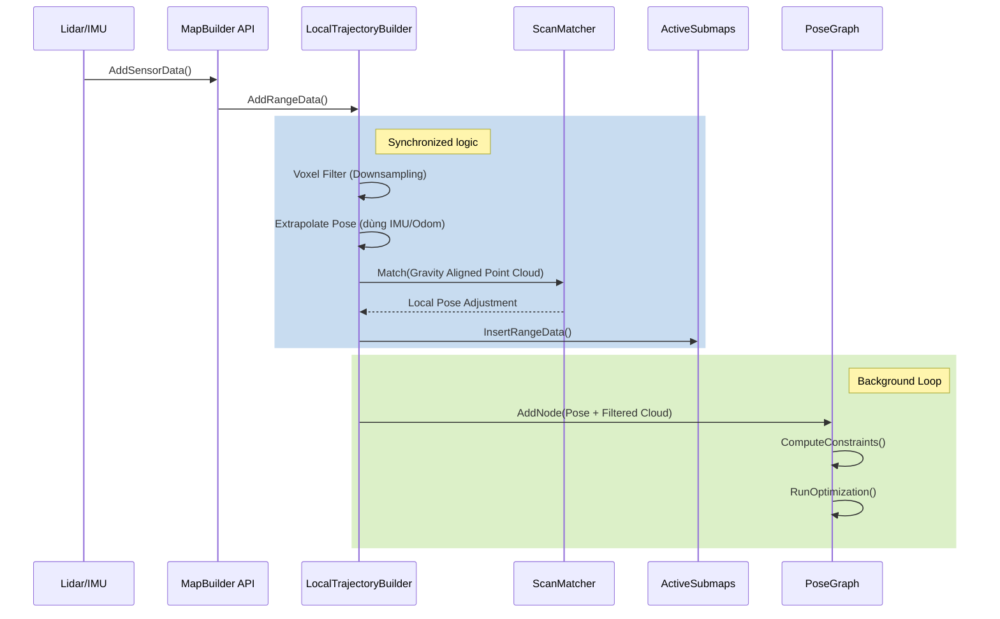

# CartographerSharp: Hướng Dẫn Kỹ Thuật Chuyên Su (Developer Guide)

Tài liệu này cung cấp cái nhìn su sắc về nội bộ (internals), cấu hình nng cao và cách mở rộng `CartographerSharp`. Đy là tài liệu bổ sung cho `README.md`.

## Mục Lục

1. [Vòng Đời Dữ Liệu (The Life of a Scan)](#1-vòng-đời-dữ-liệu)
2. [Cơ Chế Local SLAM](#2-cơ-chế-local-slam)
3. [Cơ Chế Global SLAM (Pose Graph)](#3-cơ-chế-global-slam)
4. [Giải Thích Tham Số Cấu Hình](#4-giải-thích-tham-số-cấu-hình)
5. [Mở Rộng & Tùy Biến](#5-mở-rộng--tùy-biến)

---

## 1. Vòng Đời Dữ Liệu

Hiểu đường đi của dữ liệu là chìa khóa để debug và tối ưu hóa.



### 1.1 Input Processing
- **Time Conversion**: Mọi timestamp đều được chuyển về `ticks` (C# `DateTime.Ticks` hoặc Universal Time).
- **Multiple Sensors**: Dữ liệu từ nhiều Lidar được hợp nhất (merged) dựa trên thời gian nếu chúng được cấu hình trong cùng một trajectory.

### 1.2 Extrapolation
Trước khi scan matching, hệ thống cần một "dự đoán" vị trí robot.
- `PoseExtrapolator` sử dụng:
  - **IMU**: Để dự đoán hướng (rotation) chính xác.
  - **Odometry**: Để dự đoán dịch chuyển (translation).
  - **Constant Velocity Model**: Nếu không có Odom, giả định vận tốc không đổi từ các scan trước.

---

## 2. Cơ Chế Local SLAM

Local SLAM chịu trách nhiệm xác định vị trí robot tức thời so với submap hiện tại.

### 2.1 Voxel Filtering
Giảm số lượng điểm để tăng tốc độ tính toán.
- `VoxelFilterSize`: Kích thước cạnh của voxel lập phương (ví dụ 0.05m).
- Mỗi voxel chỉ giữ lại 1 điểm đại diện (thường là tâm hoặc điểm đầu tiên).

### 2.2 Scan Matching Logic
CartographerSharp sử dụng chiến lược 2 bước:

1. **Real-Time Correlative Scan Matcher (CSM)**:
   - **Mục đích**: Tìm kiếm trong một vùng ln cận (Search Window) để tránh rơi vào cực trị địa phương (local minima).
   - **Cách hoạt động**: Thử các tư thế (poses) khác nhau xung quanh pose dự đoán, tính điểm khớp với grid map.
   - **Ưu điểm**: Mạnh mẽ, không cần gradient.
   - **Nhược điểm**: Chậm nếu Search Window lớn.

2. **Ceres Scan Matcher**:
   - **Mục đích**: Tinh chỉnh kết quả của CSM để đạt độ chính xác cao nhất (sub-pixel).
   - **Cách hoạt động**: Giải bài toán tối ưu phi tuyến (Non-linear Least Squares).
   - **Cost Function**: $J = w_{map} * (1 - P(M, T\cdot p))^2 + w_{trans} * ||T_{trans}||^2 + w_{rot} * ||T_{rot}||^2$
     - $P(M, x)$: Xác suất tại vị trí x trên bản đồ M.
     - $T$: Biến đổi (pose) cần tìm.

### 2.3 Submaps
- Dữ liệu được chèn vào **Probability Grid**.
- Mỗi ô (cell) lưu trữ xác suất có vật cản (odds).
- Một `ActiveSubmaps` giữ 2 submap cùng lúc:
  1. Old Submap: Đang hoàn thiện, dùng để scan match.
  2. New Submap: Đang xây dựng, để đảm bảo sự liên tục khi Old Submap hoàn thành.

---

## 3. Cơ Chế Global SLAM

### 3.1 Constraints
Ràng buộc (Constraint) là "lò xo" kết nối các node và submap.
- **Intra-submap constraints**: Tạo ra tự động khi node được thêm vào submap. Giữ cho quỹ đạo liền mạch.
- **Inter-submap constraints (Loop Closure)**: Kết nối node hiện tại với submap *cũ* đã đi qua từ lu.

### 3.2 Optimization Problem
Backend giải bài toán tối ưu hóa đồ thị khổng lồ (Sparse Pose Graph Optimization).
- **Biến (Variables)**: Poses của các Submap và Nodes.
- **Mục tiêu**: Giảm thiểu năng lượng của các "lò xo" (constraints).

---

## 4. Giải Thích Tham Số Cấu Hình

Dưới đây là các tham số quan trọng nhất trong `TrajectoryBuilder2DOptions` và `PoseGraphOptions`.

### 4.1 TrajectoryBuilder2DOptions

| Tham Sô | Giá Trị Mẫu | Ý Nghĩa | Tác Động Tuning |
|---------|-------------|---------|-----------------|
| `MinRange` | 0.3 | Bỏ qua điểm quá gần | Tăng nếu robot thấy "thn mình". |
| `MaxRange` | 30.0 | Bỏ qua điểm quá xa | Giảm nếu môi trường nhiễu ở xa. |
| `MinZ`/`MaxZ` | -0.8 / 2.0 | Giới hạn chiều cao (cho 3D -> 2D) | Quan trọng để loại bỏ sàn nhà/trần nhà. |
| `VoxelFilterSize` | 0.025 | Kích thước lưới lọc | Tăng (0.05) giảm CPU, giảm (0.01) tăng chi tiết. |
| `UseImu` | true | Bật/Tắt IMU | Luôn để `true` nếu có IMU. |

### 4.2 CeresScanMatcherOptions2D

| Tham Số | Giá Trị Mẫu | Ý Nghĩa |
|---------|-------------|---------|
| `OccupiedSpaceWeight` | 1.0 | Trọng số khớp bản đồ |
| `TranslationWeight` | 10.0 | Trọng số tin vào pose dự đoán (vị trí) | Tăng nếu scan matching hay bị trượt dọc hành lang. |
| `RotationWeight` | 40.0 | Trọng số tin vào pose dự đoán (hướng/IMU) | Rất quan trọng. Tăng cao nếu IMU tốt. |

### 4.3 PoseGraphOptions

| Tham Số | Giá Trị Mẫu | Ý Nghĩa |
|---------|-------------|---------|
| `OptimizeEveryNNodes` | 90 | Tần suất chạy Global SLAM | 0 = Tắt Global SLAM. Giảm số này = Chạy thường xuyên hơn (CPU cao). |
| `ConstraintBuilderOptions.MinScore` | 0.55 | Ngưỡng tin cậy Loop Closure | Giảm -> Nhạy hơn (dễ loop close sai). Tăng -> Khắt khe hơn. |
| `ConstraintBuilderOptions.SamplingRatio` | 0.3 | Tỉ lệ node để check loop closure | 1.0 = Check toàn bộ (chậm). 0.1 = Check 10%. |

---

## 5. Mở Rộng & Tùy Biến

### 5.1 Thêm Custom Cost Function
Bạn có thể định nghĩa luật tối ưu riêng bằng cách kế thừa `CostFunction` từ `CeresSharp`.

Ví dụ: Muốn robot luôn bám sát tường phải (Right Wall Following Constraint).

```csharp
public class WallFollowCostFunction : CostFunction
{
    private readonly double _targetDistance;
    
    public WallFollowCostFunction(double targetDistance)
    {
        _targetDistance = targetDistance;
        // Output: 1 residual. Input: 1 parameter block (Pose 3D: [x, y, theta])
        SetNumResiduals(1);
        AddParameterBlock(3);
    }

    public override bool Evaluate(double[][] parameters, double[] residuals, double[][] jacobians)
    {
        // ... logic tính toán khoảng cách tới tường từ pose ...
        return true;
    }
}
```

### 5.2 Xử Lý Dữ Liệu GPS
Để tích hợp GPS (FixedFramePose):
1. Cấu hình `MapBuilder` dùng `FixedFramePoseData`.
2. Định nghĩa `NavSatFix` -> `FixedFramePoseData` converter.
3. Chú ý: GPS pose cần được chuyển đổi sang hệ tọa độ của bản đồ (thường là UTM hoặc Local Tangent Plane).

---

## 6. Performance Tuning Checklist

- [ ] **Lidar Rate**: 5Hz - 20Hz là lý tưởng. Quá nhanh (>100Hz) sẽ làm nghẽn hàng đợi TrajectoryBuilder.
- [ ] **Data Compression**: Dữ liệu `TimedPointCloudData` khá nặng. CartographerSharp truyền tham chiếu (reference) nội bộ để tránh copy.
- [ ] **GC Pressure**: 
  - Hạn chế tạo `new List<Vector3>` liên tục.
  - Sử dụng `ArrayPool` nếu can thiệp su vào code core.

---
*Tài liệu này được biên soạn cho CartographerSharp v1.0 running on .NET 10.0*
