# Localization Services Architecture

Tài liệu mô tả kiến trúc và mối quan hệ giữa các service trong module Localization.

## 1. Dependency Injection Diagram

```mermaid
graph TB
    subgraph "Dependency Injection Container"
        CS[CartographerService]
        LS[LocalizationService]
        SMS[ScanMappingService]
        MSS[MapStorageService]
        OGP[OccupancyGridProvider]
        CSM[CartographerSensorManager]
    end
    
    subgraph "Interfaces"
        ICS[ICartographerService]
        ILS[ILocalizationService]
        ISMS[IScanMappingService]
        IMSS[IMapStorageService]
        IOGP[IOccupancyGridProvider]
    end
    
    subgraph "Dependencies"
        CFG[CartographerConfiguration]
        DP[IDeviceProvider]
        HUB[IHubContext CartographerHub]
        LOG[ILogger]
        OE[IOdometryEstimator]
    end
    
    subgraph "Adapters"
        LDA[LidarDataAdapter]
        IDA[ImuDataAdapter]
        ODA[OdometryDataAdapter]
    end
    
    %% Implementations
    CS -.->|implements| ICS
    LS -.->|implements| ILS
    SMS -.->|implements| ISMS
    MSS -.->|implements| IMSS
    OGP -.->|implements| IOGP
    
    %% Dependencies
    LS -->|injects| ICS
    SMS -->|injects| ICS
    CS -->|injects| CSM
    CS -->|injects| IMSS
    CS -->|injects| IOGP
    CS -->|injects| CFG
    CS -->|injects| DP
    CS -->|injects| HUB
    CS -->|injects| LOG
    CSM -->|injects| DP
    CSM -->|injects| OE
    CSM -->|injects| CFG
    CSM -->|injects| LDA
    CSM -->|injects| IDA
    CSM -->|injects| ODA
    CSM -->|injects| LOG
    MSS -->|injects| CFG
    MSS -->|injects| LOG
    OGP -->|injects| ICS
    OGP -->|injects| IMSS
    OGP -->|injects| CFG
    OGP -->|injects| LOG
    
    %% Service Registration
    CS -.->|Singleton| CS
    LS -.->|Singleton| LS
    SMS -.->|Singleton| SMS
    MSS -.->|Singleton| MSS
    OGP -.->|Singleton| OGP
    CSM -.->|Singleton| CSM
    
    style CS fill:#e1f5ff
    style LS fill:#fff4e1
    style SMS fill:#fff4e1
    style MSS fill:#e8f5e9
    style OGP fill:#e8f5e9
    style CSM fill:#f3e5f5
```

## 2. Service Relationships Diagram

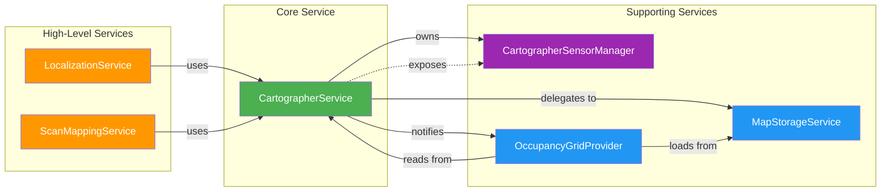

## 3. State Machine Overview

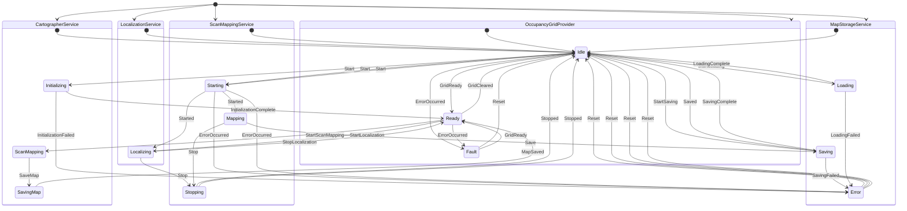

## 4. State Machine Interactions

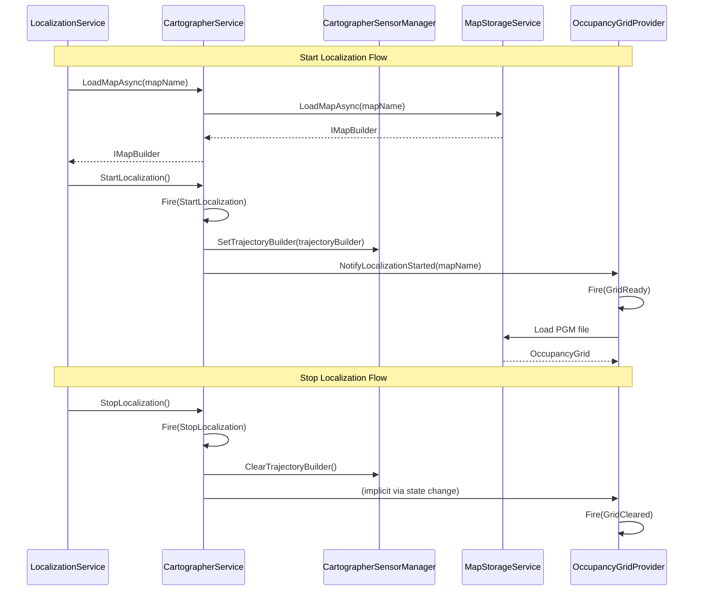

## 5. Scan Mapping Flow

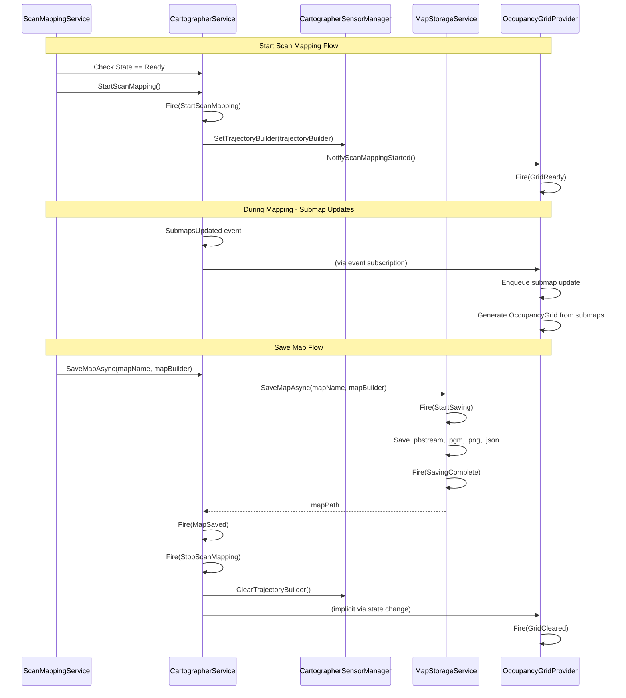

## 6. Class Hierarchy

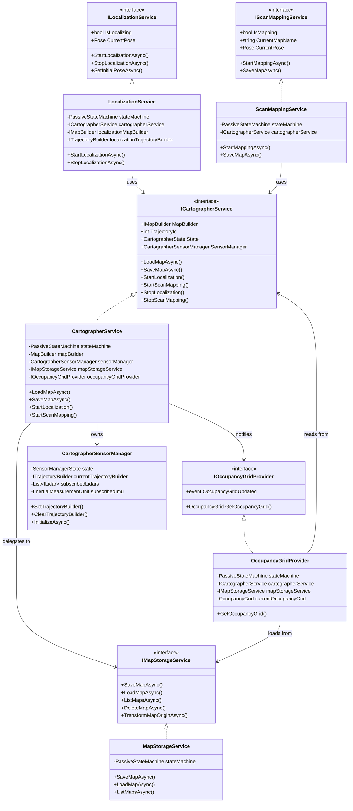

## 7. State Machine States Detail

### CartographerService States

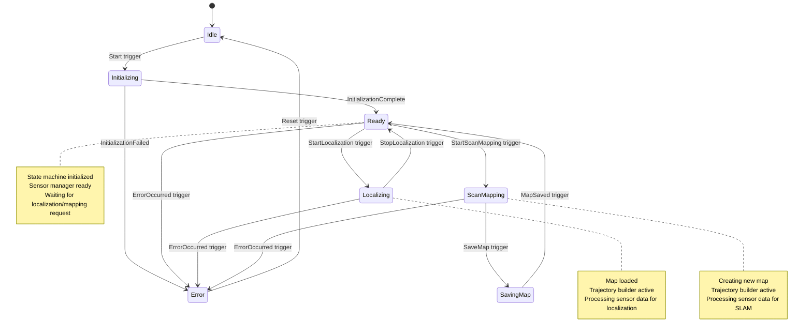

### LocalizationService States

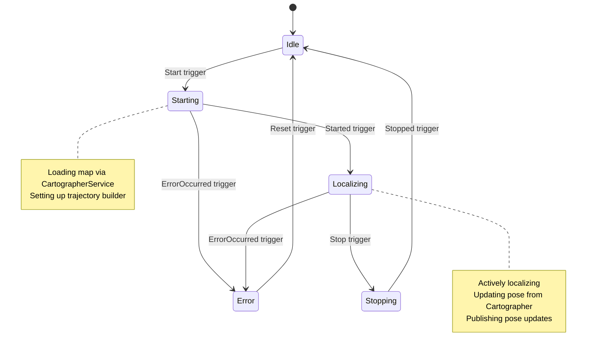

### ScanMappingService States

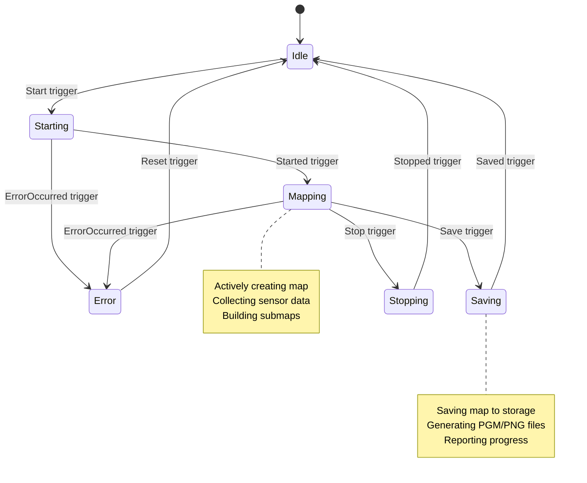

### MapStorageService States

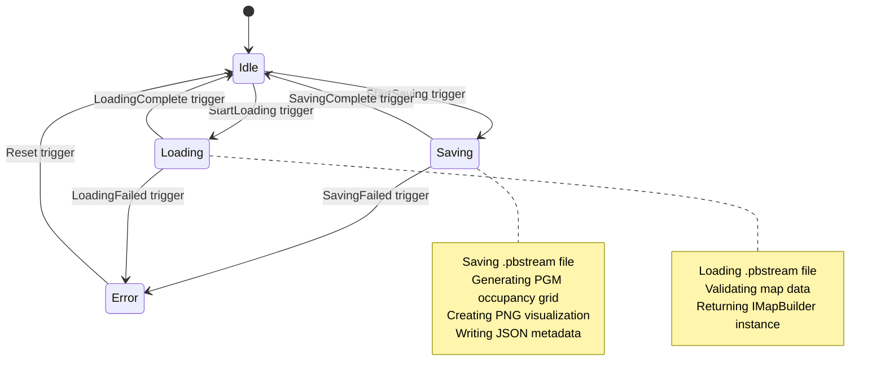

### OccupancyGridProvider States

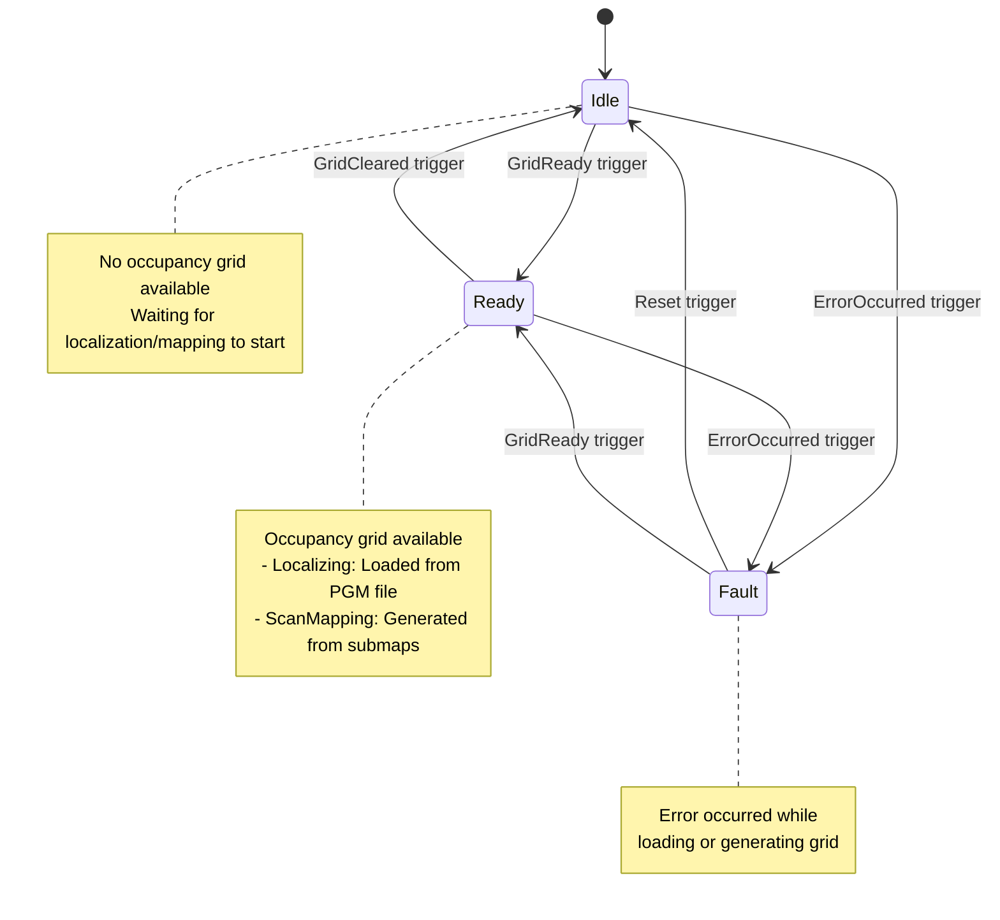

## 8. Event Flow Diagram

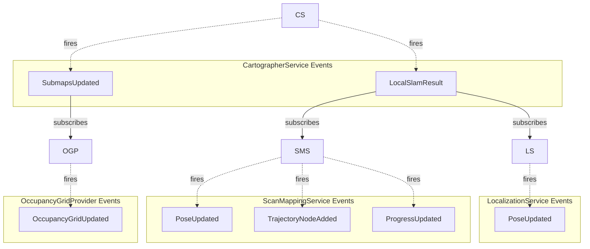

## 9. Resource Lifecycle

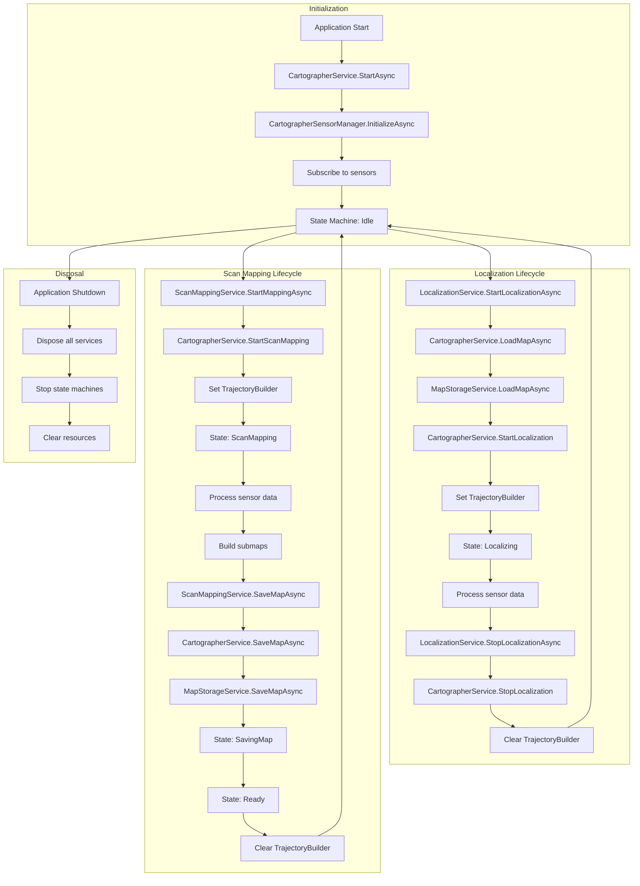

## 10. Key Design Principles

### Dependency Inversion
- `LocalizationService` và `ScanMappingService` chỉ phụ thuộc vào `ICartographerService`
- `CartographerService` là trung tâm quản lý dependencies: `CartographerSensorManager`, `MapStorageService`, `OccupancyGridProvider`

### State Machine Pattern
- Tất cả services sử dụng `Appccelerate.StateMachine` để quản lý lifecycle
- States và triggers được định nghĩa rõ ràng trong các enum riêng biệt
- State transitions được kiểm soát chặt chẽ để tránh race conditions

### Single Responsibility
- `CartographerService`: Quản lý Cartographer core và state machine chính
- `LocalizationService`: Quản lý localization lifecycle
- `ScanMappingService`: Quản lý scan mapping lifecycle
- `MapStorageService`: Quản lý lưu/load maps
- `OccupancyGridProvider`: Cung cấp occupancy grid từ maps
- `CartographerSensorManager`: Quản lý sensor subscriptions và routing

### Thread Safety
- Sử dụng `Lock` (spin lock) cho các critical sections
- Thread-safe event invocation với lock objects
- State machines được khởi tạo lazy với `field` keyword (C# 14)

### Resource Management
- Tất cả services implement `IDisposable` để cleanup resources
- State machines được stop trong `Dispose()`
- Background threads được cancel và join trong `Dispose()`

## 11. Notes

- **CartographerService** là `IHostedService`, tự động start khi application start
- **CartographerSensorManager** được inject vào `CartographerService` và expose qua property `SensorManager`
- **OccupancyGridProvider** tự động chuyển sang `Ready` state khi `CartographerService` ở `Localizing` hoặc `ScanMapping` state
- Tất cả services được đăng ký là `Singleton` trong DI container
- State machines sử dụng lazy initialization với `field` keyword (C# 14 feature)

