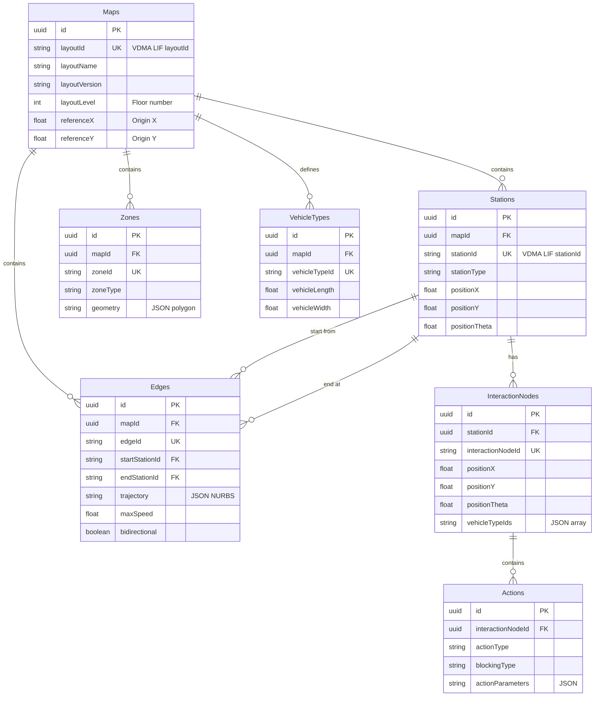

# Database Design / Thiết kế Database

## Overview / Tổng quan

MapEditor sử dụng normalized relational schema để lưu trữ map data thay vì JSON blob.

## Design Philosophy / Triết lý Thiết kế

### ❌ Anti-pattern (Not Used)

```
Maps table:
  - id
  - name
  - vdma_lif_json TEXT  <-- Store entire JSON blob
```

**Problems với JSON blob approach**:
- Cannot query specific elements
- No foreign key constraints
- Poor performance for complex queries
- Cannot index nested data

### ✅ Our Approach - Normalized Relational Schema

**Benefits**:
- Query any element directly
- Foreign keys ensure data integrity
- Efficient indexes
- Easy to join với robot positions, orders, analytics

## Entity Relationship Diagram



## Key Design Decisions

**1. Dual ID System**:
- `id` (UUID): Database primary key
- `{entity}Id` (String): VDMA LIF identifier, business key

**2. Position Decomposition**:
- Store as separate columns: `positionX`, `positionY`, `positionTheta`
- Enable spatial queries và indexing

**3. Trajectory as JSON**:
- Store NURBS trajectory as JSON string
- Complex structure, rarely queried independently

**4. Vehicle Type IDs as JSON Array**:
- Store vehicleTypeIds as JSON array
- Typically small arrays, loaded together with edge/node

**5. Actions Hierarchy**:
- Actions belong to InteractionNodes (not Stations directly)
- Follows VDMA LIF structure exactly

## Indexes for Performance

**Critical Indexes**:
- Maps: layoutId (unique)
- Stations: mapId, stationId, stationType, (positionX, positionY)
- Edges: mapId, edgeId, startStationId, endStationId
- InteractionNodes: stationId, interactionNodeId

## Related Documents / Tài liệu Liên quan

- [MapEditor Overview](README.md) - Tổng quan MapEditor
- [VDMA LIF Standard](VDMA_LIF_Standard.md) - Chuẩn VDMA LIF
- [PathFinding](PathFinding.md) - Sử dụng database để pathfinding

---

**Last Updated**: 2025-11-13
