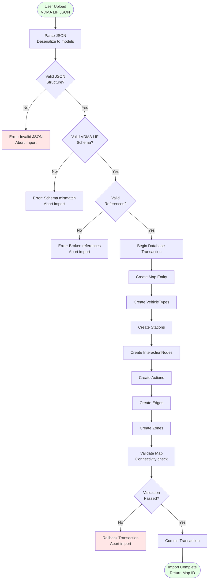
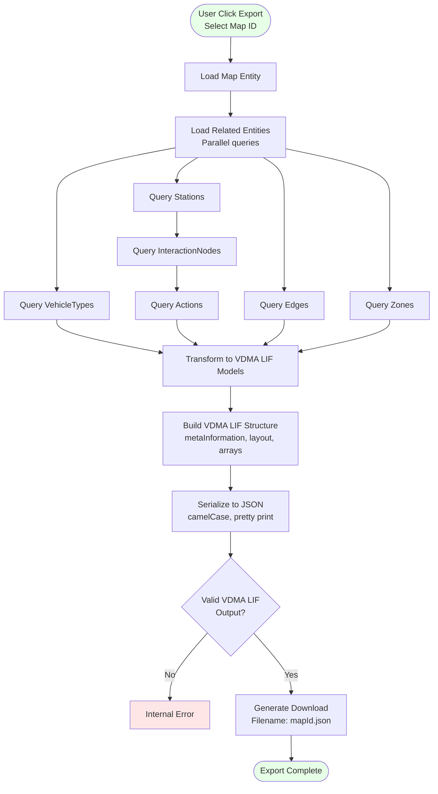

# Import/Export Workflow / Quy trình Import/Export

## Overview / Tổng quan

MapEditor hỗ trợ import và export VDMA LIF JSON format để trao đổi map data với các hệ thống khác.

## Import Process / Quy trình Import

## Export Process / Quy trình Export

## ✅ Data Integrity Guarantees

**Import Validations**:
1. JSON Syntax: Valid JSON format
2. Schema Compliance: Required fields present
3. Reference Integrity: Edges reference existing stations
4. Geometric Validity: Positions, trajectories valid
5. Unique Constraints: No duplicate IDs

**Export Guarantees**:
1. Completeness: All related entities included
2. Format Compliance: Valid VDMA LIF schema
3. Reference Resolution: All IDs properly mapped
4. Transaction Safety: All-or-nothing import

## Related Documents / Tài liệu Liên quan

- [MapEditor Overview](README.md) - Tổng quan MapEditor
- [VDMA LIF Standard](VDMA_LIF_Standard.md) - Format specification
- [Database Design](Database_Design.md) - Database schema

---

**Last Updated**: 2025-11-13
