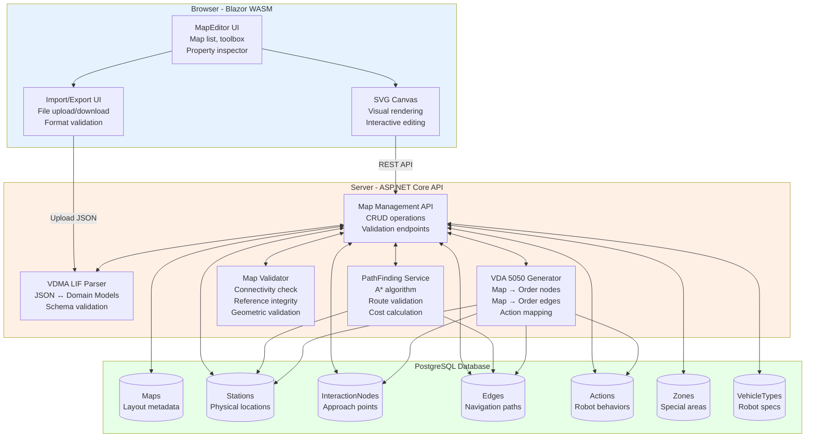
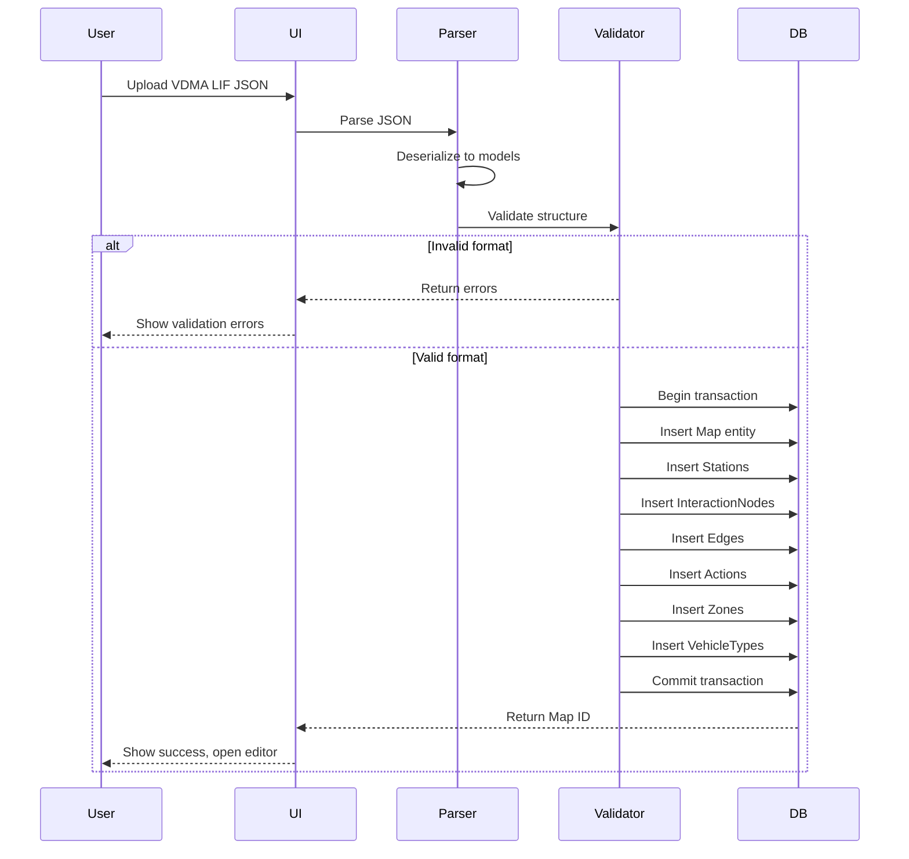
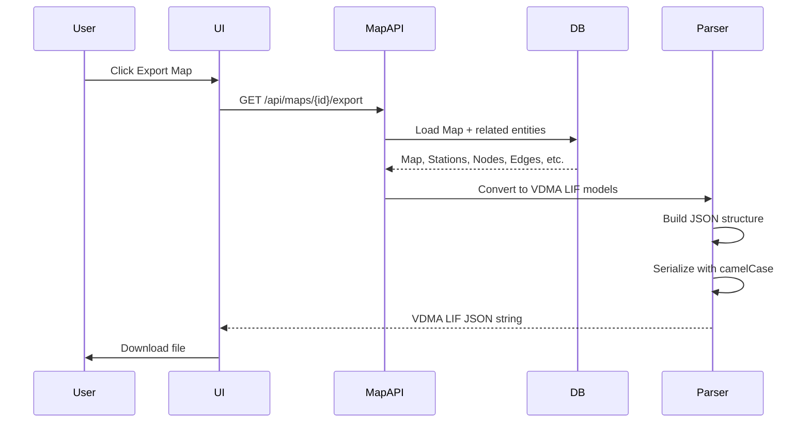
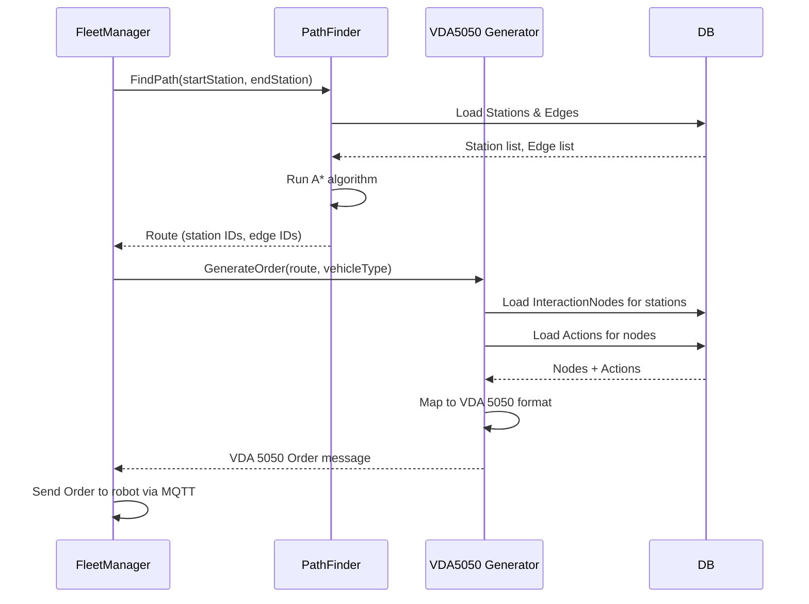

# MapEditor Documentation / Tài liệu MapEditor

## Overview / Tổng quan

**MapEditor** là shared library cung cấp công cụ web-based để tạo, chỉnh sửa và quản lý bản đồ nhà máy theo chuẩn VDMA LIF (Layout Interchange Format). Module này được sử dụng bởi **FleetManager** để định nghĩa không gian hoạt động của robot AMR.

## Problem & Solution / Vấn đề & Giải pháp

### Challenges / Thách thức

**Trong môi trường nhà máy thực tế**:
- Bản đồ nhà máy phức tạp với hàng trăm điểm (stations, nodes, edges)
- Cần import/export data từ nhiều nguồn khác nhau (CAD tools, other fleet systems)
- Operators không phải programmers, cần giao diện trực quan
- Phải tuân thủ chuẩn VDMA LIF để tích hợp với hệ thống khác
- Database cần normalized schema để query hiệu quả (không lưu JSON blob)
- PathFinding để validate routes và generate VDA 5050 orders
- Multi-map support cho nhiều tầng, nhiều khu vực

### ✅ MapEditor Solution / Giải pháp MapEditor

**Visual Editor**: Blazor WASM + SVG canvas
- Vẽ và chỉnh sửa map objects trực quan (drag, drop, resize)
- Pan, zoom, layer management
- Real-time validation với visual feedback

**VDMA LIF Standard**: Import/export JSON format
- Tuân thủ VDMA 40499-1 và 40499-2 specifications
- Interoperability với CAD tools và other fleet systems
- Complete map data: stations, edges, zones, vehicle types

**Normalized Database**: PostgreSQL với relational schema
- Separate tables cho Maps, Stations, InteractionNodes, Edges, Actions
- Foreign key constraints đảm bảo data integrity
- Efficient queries (find all charging stations, edges by speed limit)
- No JSON blob storage (except for complex nested data như trajectory)

**PathFinding Integration**: A* algorithm
- Validate route existence trước khi dispatch missions
- Calculate shortest/fastest paths
- Support bidirectional và unidirectional edges
- Consider vehicle type compatibility

**VDA 5050 Integration**: Generate Order messages
- Convert map data (stations, edges) thành VDA 5050 nodes và edges
- Include actions từ stations vào order
- Apply vehicle type filtering

### Use Cases / Trường hợp Sử dụng

**Initial Setup**:
- Import VDMA LIF JSON từ AutoCAD hoặc design tool
- Visual editing để adjust positions, thêm bớt elements
- Define stations (pickup, dropoff, charging, parking)
- Configure edges (paths, speed limits, directions)
- Define zones (restricted areas, slow-speed zones)
- Set up vehicle types (dimensions, envelopes)

**Operations** (FleetManager):
- Query database để tạo VDA 5050 Orders cho robots
- PathFinding service validate routes trước khi dispatch
- Operators view map trên dashboard với real-time robot positions
- Export VDMA LIF để backup hoặc share với other systems

**Maintenance**:
- Update map khi factory layout thay đổi
- Add/remove stations khi production changes
- Adjust edge configurations (speed limits, orientations)
- Manage multiple map versions (version control)

## System Architecture / Kiến trúc Hệ thống

### Component Overview / Tổng quan Thành phần



### Data Flow / Luồng Dữ liệu

**Import Flow** (VDMA LIF JSON → Database):


**Export Flow** (Database → VDMA LIF JSON):


**Order Generation Flow** (Map → VDA 5050 Order):


## Cấu trúc Tài liệu / Documentation Structure

Tài liệu MapEditor được tổ chức thành các module riêng biệt để dễ dàng tra cứu và bảo trì:

```
docs/MapEditor/
├── README.md                    # File này - Tổng quan MapEditor
├── VDMA_LIF_Standard.md         # Chuẩn VDMA LIF
├── Database_Design.md            # Thiết kế Database
├── SVG_Canvas.md                # Kiến trúc Canvas SVG
├── PathFinding.md               # Kiến trúc PathFinding
├── ImportExport.md              # Quy trình Import/Export
├── VDA5050_Integration.md       # Tích hợp VDA 5050
└── Design_Rationale.md          # Lý do Thiết kế
```

## [VDMA LIF Standard](VDMA_LIF_Standard.md) - Chuẩn VDMA LIF

VDMA LIF (Layout Interchange Format) là chuẩn quốc tế để mô tả factory layout cho AGV/AMR systems.

**[Xem chi tiết →](VDMA_LIF_Standard.md)**

## [Database Design](Database_Design.md) - Thiết kế Database

MapEditor sử dụng normalized relational schema thay vì JSON blob để đảm bảo query flexibility và data integrity.

**[Xem chi tiết →](Database_Design.md)**

## [SVG Canvas Architecture](SVG_Canvas.md) - Kiến trúc Canvas SVG

MapEditor sử dụng SVG canvas với Blazor WASM để render và edit maps với interactive features.

**[Xem chi tiết →](SVG_Canvas.md)**

## [PathFinding Architecture](PathFinding.md) - Kiến trúc Tìm đường

MapEditor tích hợp A* algorithm để tính toán routes giữa các stations trên map.

**[Xem chi tiết →](PathFinding.md)**

## [Import/Export Workflow](ImportExport.md) - Quy trình Import/Export

MapEditor hỗ trợ import và export VDMA LIF JSON format với validation và transaction safety.

**[Xem chi tiết →](ImportExport.md)**

## [VDA 5050 Integration](VDA5050_Integration.md) - Tích hợp VDA 5050

MapEditor convert map data thành VDA 5050 Order messages để gửi đến robot.

**[Xem chi tiết →](VDA5050_Integration.md)**

## [Design Rationale](Design_Rationale.md) - Lý do Thiết kế

Giải thích các quyết định thiết kế quan trọng: VDMA LIF, Blazor WASM + SVG, normalized database, PathFinding.

**[Xem chi tiết →](Design_Rationale.md)**

## Related Documents / Tài liệu Liên quan

- [Architecture Overview](../architecture/README.md) - System architecture overview
- [FleetManager Documentation](../fleetmanager/README.md) - Usage context and integration
- [VDA 5050 Implementation](../vda5050/README.md) - Order message generation
- [Development Guide](../development/README.md) - Implementation guidelines
- [ScriptEngine Documentation](../scriptengine/README.md) - Scripting integration

## External References / Tham khảo Ngoài

**Standards**:
- [VDMA 40499-1](https://www.vdma.org/) - Common Definitions for LIF
- [VDMA 40499-2](https://www.vdma.org/) - Layout Interchange Format Specification
- [VDA 5050](https://www.vda.de/) - Communication Interface for AMR Systems
- [GitHub: VDMA LIF](https://github.com/continua-systems/vdma-lif) - Reference implementation

**Algorithms**:
- [A* Search Algorithm](https://en.wikipedia.org/wiki/A*_search_algorithm) - PathFinding
- [NURBS](https://en.wikipedia.org/wiki/Non-uniform_rational_B-spline) - Trajectory representation

**Technologies**:
- [Blazor WebAssembly](https://dotnet.microsoft.com/apps/aspnet/web-apps/blazor) - Client framework
- [SVG Specification](https://www.w3.org/TR/SVG2/) - Vector graphics format
- [PostgreSQL](https://www.postgresql.org/) - Database system
- [Entity Framework Core](https://learn.microsoft.com/en-us/ef/core/) - ORM

---

**Status**: Architecture & Design Document (No Implementation Code)
**Focus**: Concepts, Architecture, Design Rationale, Mermaid Diagrams
**Last Updated**: 2025-11-13
**Version**: 2.1 (Modular documentation structure)
