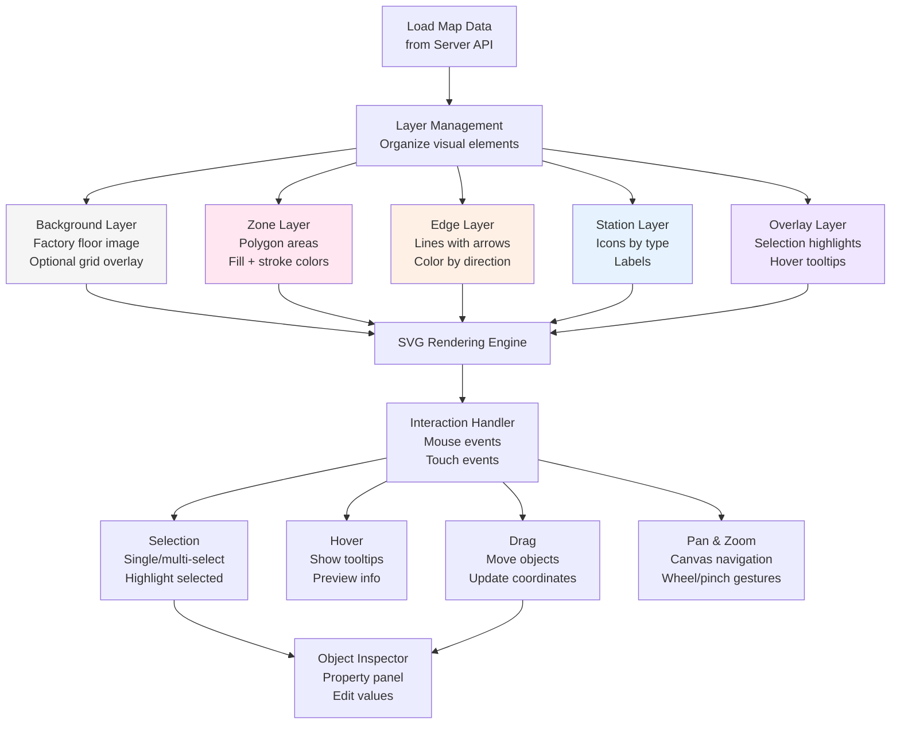

# SVG Canvas Architecture / Kiến trúc Canvas SVG

## Overview / Tổng quan

MapEditor sử dụng SVG canvas để render và edit maps với interactive features.

## Rendering Strategy / Chiến lược Render

## Coordinate Systems / Hệ tọa độ

**Two Coordinate Systems**:

1. **Screen Coordinates** (Canvas pixels):
   - Origin: Top-left corner
   - X-axis: Right (positive)
   - Y-axis: Down (positive)
   - Used for: Rendering, mouse events

2. **World Coordinates** (Physical meters):
   - Origin: Map referencePoint
   - X-axis: Right (positive)
   - Y-axis: Up (positive)
   - Used for: VDMA LIF data, robot positions

**Transformation**: World ↔ Screen với scale, translate, và Y-axis flip

## Visual Styling Conventions

**Station Icons by Type**:
- Charging: Lightning bolt, yellow
- Pickup: Box icon, green
- Dropoff: Outbox icon, red
- Parking: P icon, blue

**Edge Visualization**:
- Bidirectional: Gray line, no arrow
- Unidirectional: Blue line, arrow at end
- Selected: Orange outline, dashed

**Zone Appearance**:
- Safety Zone: Blue fill, semi-transparent
- Restricted Zone: Red fill, diagonal stripes
- Speed Limit Zone: Yellow fill

## Editing Workflows

**Object Creation**: Tool select → Click canvas → Create → Property edit → Validate

**Object Manipulation**: Click → Select → Drag/Edit → Validate → Save

**Multi-Object Operations**: Box selection, Shift+Click, Batch edit, Align tools

## Related Documents / Tài liệu Liên quan

- [MapEditor Overview](README.md) - Tổng quan MapEditor
- [VDMA LIF Standard](VDMA_LIF_Standard.md) - Map data structure

---

**Last Updated**: 2025-11-13
