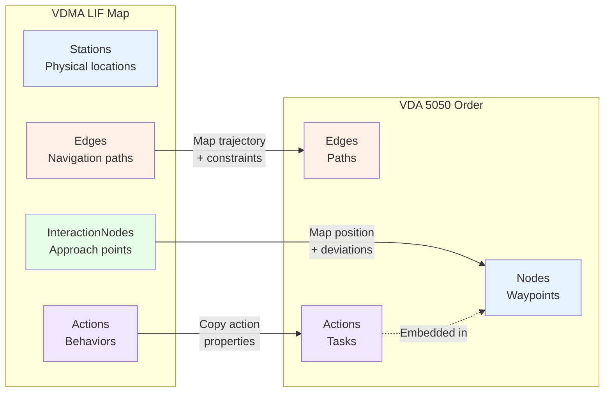
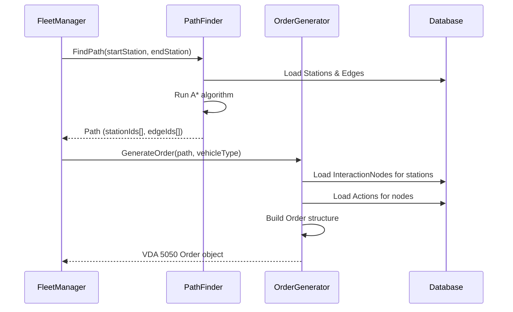

# VDA 5050 Integration / Tích hợp VDA 5050

## Overview / Tổng quan

MapEditor convert map data thành VDA 5050 Order messages để gửi đến robot.

## Conversion Concept

## Order Generation Flow

## Mapping Rules

**InteractionNode → VDA 5050 Node**:
- nodeId: InteractionNode.interactionNodeId
- sequenceId: Even numbers (0, 2, 4, ...)
- nodePosition: From InteractionNode position
- actions: From Actions table

**Edge → VDA 5050 Edge**:
- edgeId: Edge.edgeId
- sequenceId: Odd numbers (1, 3, 5, ...)
- trajectory: From Edge.trajectory
- maxSpeed: From Edge.maxSpeed

**Action → VDA 5050 Action**:
- actionType: Action.actionType
- blockingType: Action.blockingType
- actionParameters: Action.actionParameters

## Vehicle Type Filtering

**Filtering Logic**:
- Load InteractionNodes for each station
- Check vehicleTypeIds compatibility
- Filter edges by vehicleTypeIds
- Build Order với filtered elements only

## Related Documents / Tài liệu Liên quan

- [MapEditor Overview](README.md) - Tổng quan MapEditor
- [PathFinding](PathFinding.md) - Tính toán path trước khi generate order
- [VDA 5050 Integration](../vda5050/README.md) - Chi tiết về VDA 5050 protocol

---

**Last Updated**: 2025-11-13
