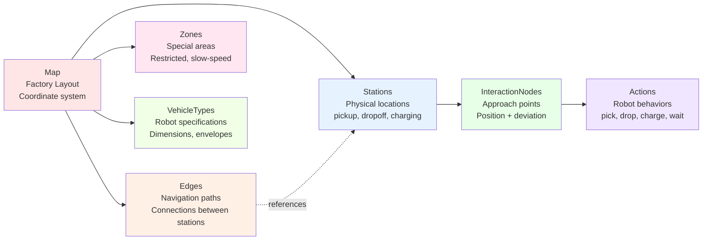
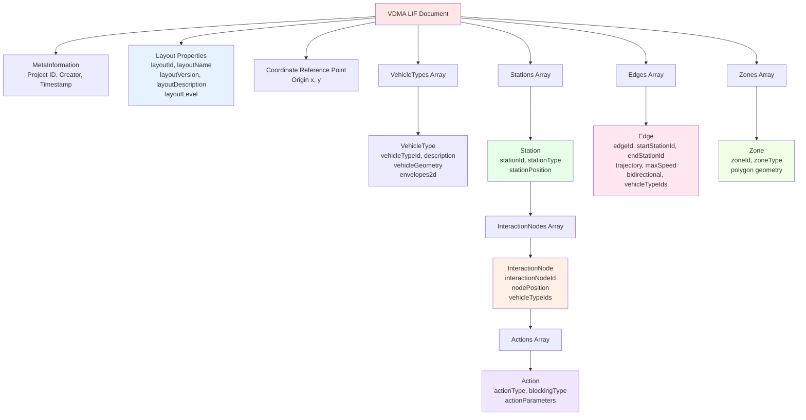

# VDMA LIF Standard / Chuẩn VDMA LIF

## Overview / Tổng quan

VDMA LIF (Layout Interchange Format) là chuẩn quốc tế để mô tả factory layout cho AGV/AMR systems.

## Conceptual Model / Mô hình Khái niệm

## Object Hierarchy / Phân cấp Đối tượng

## Core Concepts / Khái niệm Cốt lõi

**Map / Layout**:
- Top-level container cho tất cả map elements
- Defines coordinate system (origin, resolution)
- Properties: layoutId, name, version, level (floor number)

**Station** (Physical location):
- Represents a physical point trong factory
- Properties: stationId, stationType, stationPosition (x, y, theta)
- Contains one hoặc nhiều InteractionNodes

**InteractionNode** (Approach point):
- Specific position nơi robot interacts với station
- Multiple nodes per station cho different vehicle types
- Properties: interactionNodeId, position, allowedDeviations
- Contains Actions to execute

**Action** (Robot behavior):
- Defines what robot does tại InteractionNode
- Properties: actionType, blockingType, actionParameters
- Blocking types: HARD, SOFT, NONE

**Edge** (Navigation path):
- Connection between two stations
- Properties: edgeId, startStationId, endStationId, trajectory
- bidirectional: true/false

**Zone** (Special area):
- 2D polygon area với special properties
- Zone types: safetyZone, restrictedZone, speedLimitZone

**VehicleType** (Robot specification):
- Defines robot dimensions và capabilities
- Referenced by vehicleTypeIds trong stations, nodes, edges

## Related Documents / Tài liệu Liên quan

- [MapEditor Overview](README.md) - Tổng quan MapEditor
- [Database Design](Database_Design.md) - Cấu trúc database cho VDMA LIF
- [Import/Export](ImportExport.md) - Import/Export VDMA LIF JSON

---

**Last Updated**: 2025-11-13
