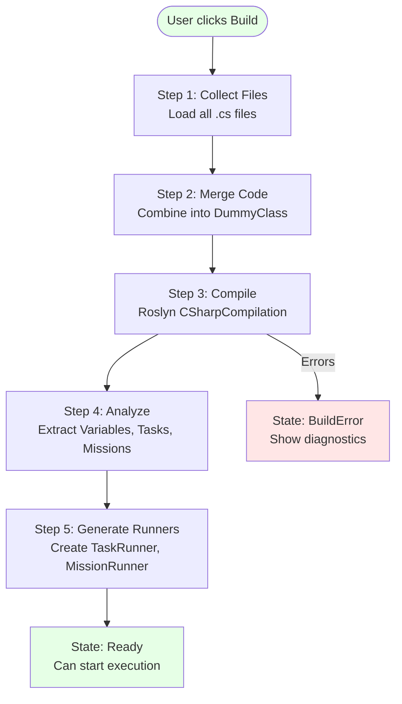

# Script Compilation Process / Quá trình Biên dịch

##Overview / Tổng quan

ScriptEngine compile C# scripts sử dụng Roslyn để extract metadata và generate executable runners.

##Compilation Flow / Luồng Biên dịch

##Chi tiết từng bước / Step Details

1. **Collect Files**: Load tất cả `.cs` files từ filesystem
2. **Merge Code**: Combine vào một `DummyClass` để phân tích
3. **Compile**: Sử dụng Roslyn để compile và lấy SemanticModel
4. **Analyze**: Extract metadata (variables với `[Variable]`, methods với `[Task]`/`[Mission]`)
5. **Generate Runners**: Tạo executable classes cho mỗi task/mission

##IntelliSense Support / Hỗ trợ IntelliSense

- Sử dụng AdhocWorkspace trên WebAssembly
- IntelliSense, Hover information, Diagnostics
- Real-time code analysis
- No server round-trip for IntelliSense

##Related Documents / Tài liệu Liên quan

- [ScriptEngine Overview](README.md) - Tổng quan ScriptEngine
- [State Machine Design](StateMachine_Design.md) - Kiến trúc State Machine chi tiết
- [Script Files](ScriptFiles.md) - Quản lý file script

---

**Last Updated**: 2025-11-13

