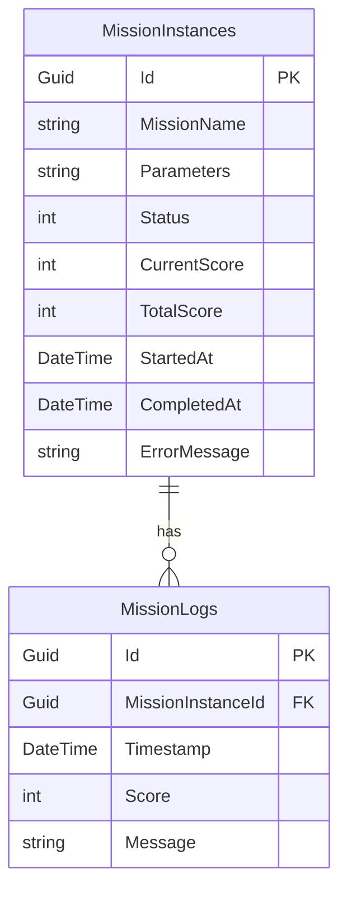

# Data Persistence / Lưu trữ Dữ liệu

##Overview / Tổng quan

ScriptEngine lưu trữ Mission instances và logs vào database để track execution history.

##Mission Instances

Missions được persist vào database:

##Status Enum

- `0`: Running
- `1`: Completed
- `2`: Cancelled
- `3`: Failed

##Backup & Restore / Sao lưu & Khôi phục

### Backup

**Format**: ZIP file chứa tất cả script files với folder structure

**Process**:
1. User clicks "Backup"
2. Server collect all files from script directory
3. Create ZIP with preserved structure
4. Store: `ScriptBackup_2025-11-13_143022.zip`
5. Optionally download to browser

### Restore

**Process**:
1. User select backup (from list or upload ZIP)
2. Engine transitions to Idle
3. Extract ZIP
4. Validate files
5. Replace current scripts if valid

##Related Documents / Tài liệu Liên quan

- [ScriptEngine Overview](README.md) - Tổng quan ScriptEngine
- [Missions](Missions.md) - Mission execution và persistence
- [Script Files](ScriptFiles.md) - File system storage

---

**Last Updated**: 2025-11-13

