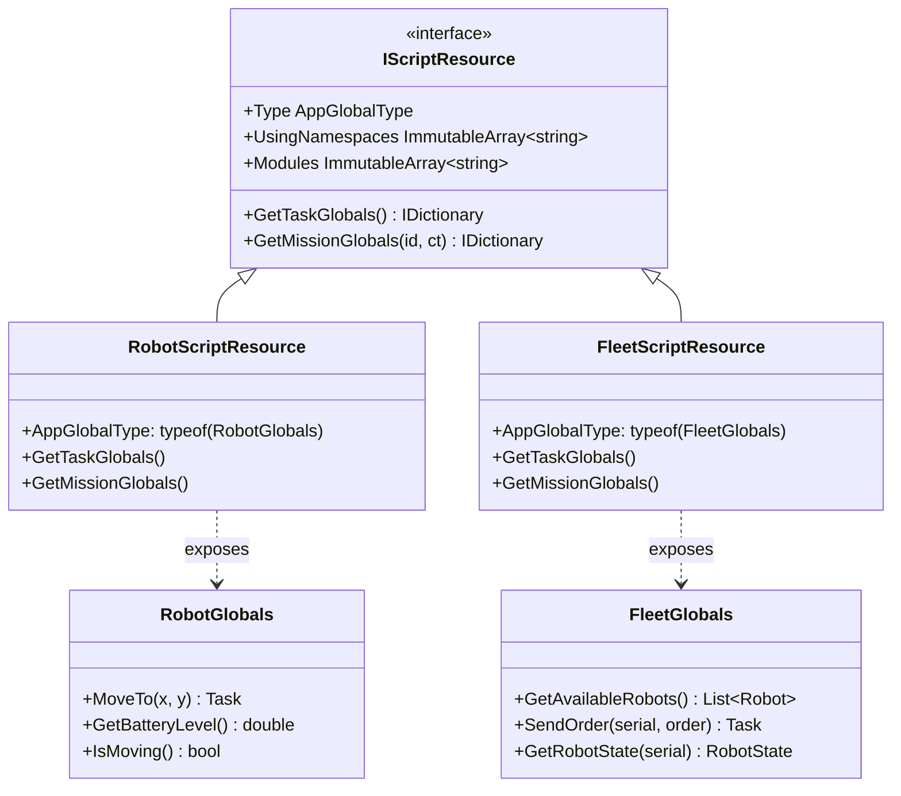

# Extension APIs / API Mở rộng

##Overview / Tổng quan

Apps implement `IScriptResource` interface để expose custom APIs cho scripts.

##IScriptResource Interface



##RobotApp Example

**Define AppGlobalType**:
```csharp
public class RobotScriptGlobals
{
    public Task MoveTo(double x, double y) { }
    public double GetBatteryLevel() { }
    public bool IsMoving() { }
}
```

**Use in Script**:
```csharp
[Task(Interval = 5000)]
public async Task CheckBattery()
{
    var level = Robot.GetBatteryLevel();
    Logger.Info($"Battery: {level}%");

    if (level < 20.0)
    {
        await Robot.MoveTo(0, 0); // Home position
    }
}
```

##FleetManager Example

**Define AppGlobalType**:
```csharp
public class FleetScriptGlobals
{
    public List<Robot> GetAvailableRobots() { }
    public Task SendOrder(string robotSerial, Order order) { }
    public RobotState GetRobotState(string robotSerial) { }
    public Task MoveToNode(string robotSerial, string nodeId) { }
    public Task MoveToStation(string robotSerial, string stationId) { }
}
```

**Use in Script**:
```csharp
[Task(Interval = 10000)]
public void MonitorFleet()
{
    var robots = Fleet.GetAvailableRobots();
    foreach (var robot in robots)
    {
        var state = Fleet.GetRobotState(robot.SerialNumber);
        if (state?.BatteryCharge < 20.0)
        {
            Logger.Warning($"Robot {robot.SerialNumber} low battery");
        }
    }
}
```

##Related Documents / Tài liệu Liên quan

- [ScriptEngine Overview](README.md) - Tổng quan ScriptEngine
- [FleetManager ScriptEngine Module](../fleetmanager/ScriptEngine.md) - FleetManager implementation
- [RobotApp Documentation](../robotapp/README.md) - RobotApp implementation

---

**Last Updated**: 2025-11-13

