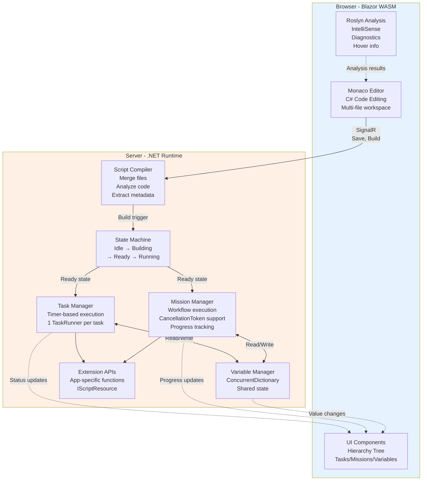

# ScriptEngine Documentation / Tài liệu ScriptEngine

##Overview / Tổng quan

**ScriptEngine** là shared library cho phép viết và thực thi C# scripts trực tiếp trên web mà không cần rebuild ứng dụng. Module này được dùng bởi **RobotApp** và **FleetManager** để mở rộng chức năng linh hoạt.

###Vấn đề Cần Giải quyết

**Thách thức**: Trong môi trường sản xuất thực tế:
- Mỗi robot có hành vi riêng (custom actions, sensor processing)
- Mỗi nhà máy có quy trình khác nhau (business logic)
- Cần tích hợp với thiết bị bên thứ 3 (conveyors, elevators, stations)
- Không thể rebuild/redeploy app mỗi lần thay đổi logic

**Giải pháp ScriptEngine**:
- ✅ Viết C# code trực tiếp trên web browser
- ✅ IntelliSense, diagnostics, refactoring (Monaco Editor + Roslyn)
- ✅ Multi-file support (organize code như C# project)
- ✅ Variables, Tasks (periodic), Missions (workflows)
- ✅ Extension APIs (mỗi app expose custom functions)
- ✅ Real-time updates qua SignalR

###Use Cases / Trường hợp Sử dụng

**RobotApp**:
- Custom VDA 5050 actions (pick, drop, scan, charge)
- Robot-specific behaviors (sensor calibration, custom navigation)
- Hardware integration (custom actuators, sensors)

**FleetManager**:
- Mission planning algorithms (optimize routes, load balancing)
- External system integration (HTTP APIs, MQTT, OPC UA)
- Business logic (station management, elevator control, conveyor sync)
- Custom analytics and reporting

##Architecture / Kiến trúc

### System Overview



### State Machine / Máy Trạng thái

ScriptEngine sử dụng state machine để quản lý lifecycle của Engine, Tasks và MissionInstances.

**[Xem chi tiết về State Machine Architecture →](StateMachine_Design.md)**

**Tóm tắt**:
- **Engine State Machine**: Quản lý trạng thái của ScriptEngine (Initializing → Idle → Building → Ready → Starting → Running → Stopping)
- **Task State Machine**: Quản lý trạng thái của mỗi Task (Idle → Running → Pausing → Paused → Resuming → Stopping → Stopped → Error)
- **MissionInstance State Machine**: Quản lý trạng thái của mỗi MissionInstance (Idle → Running → Pausing → Paused → Resuming → Canceling → Completed/Canceled/Error)

##Cấu trúc Tài liệu / Documentation Structure

Tài liệu ScriptEngine được tổ chức thành các module riêng biệt để dễ dàng tra cứu và bảo trì:

```
docs/ScriptEngine/
├── README.md                    # File này - Tổng quan ScriptEngine
├── StateMachine_Design.md       # Kiến trúc State Machine (Task, Mission, Engine)
├── ScriptFiles.md               # Quản lý File Script
├── Variables.md                 # Biến Toàn cục
├── Tasks.md                     # Nhiệm vụ Định kỳ
├── Missions.md                  # Nhiệm vụ Dài hạn
├── Compilation.md               # Quá trình Biên dịch
├── ExtensionAPIs.md             # API Mở rộng
├── BuiltInAPIs.md               # API Tích hợp Sẵn
├── DataPersistence.md           # Lưu trữ Dữ liệu & Backup/Restore
└── Security.md                  # Bảo mật & Giới hạn
```

##Core Concepts / Khái niệm Cốt lõi

### 1. [Script Files](ScriptFiles.md) - File Script

Scripts được tổ chức như C# project với multi-file support, file locking, và backup/restore.

**[Xem chi tiết →](ScriptFiles.md)**

### 2. [Variables](Variables.md) - Biến Toàn cục

Shared state được chia sẻ giữa tất cả scripts với thread-safe storage.

**[Xem chi tiết →](Variables.md)**

### 3. [Tasks](Tasks.md) - Nhiệm vụ Định kỳ

Periodic execution với timer, phù hợp cho monitoring và automation đơn giản.

**[Xem chi tiết →](Tasks.md)**

### 4. [Missions](Missions.md) - Nhiệm vụ Dài hạn

Long-running workflows với progress tracking, cancellable, và persist to database.

**[Xem chi tiết →](Missions.md)**

##[Script Compilation Process](Compilation.md) - Quá trình Biên dịch

ScriptEngine compile C# scripts sử dụng Roslyn để extract metadata và generate executable runners.

**[Xem chi tiết →](Compilation.md)**

##[Extension APIs](ExtensionAPIs.md) - API Mở rộng

Apps implement `IScriptResource` interface để expose custom APIs cho scripts (RobotApp và FleetManager).

**[Xem chi tiết →](ExtensionAPIs.md)**

##[Built-in APIs](BuiltInAPIs.md) - API Tích hợp Sẵn

Các APIs có sẵn trong tất cả scripts: Logger, Mission Management, Task Control.

**[Xem chi tiết →](BuiltInAPIs.md)**

##[Data Persistence](DataPersistence.md) - Lưu trữ Dữ liệu

Mission instances và logs được lưu vào database. Backup và restore scripts với ZIP format.

**[Xem chi tiết →](DataPersistence.md)**

## ⚠️ [Security & Limitations](Security.md) - Bảo mật & Giới hạn

MetadataReference restrictions và thread safety considerations.

**[Xem chi tiết →](Security.md)**

##Design Rationale / Lý do Thiết kế

### Tại sao C# Scripting?

| Lý do | Giải thích |
|-------|------------|
| **Familiar syntax** | Developers đã biết C# |
| **Type safety** | Strong typing giảm runtime errors |
| **IntelliSense** | Code completion, diagnostics |
| **Roslyn power** | Full language analysis |
| **Async/await** | Natural asynchronous programming |

### Tại sao Monaco Editor + Roslyn trên WASM?

| Lý do | Giải thích |
|-------|------------|
| **Client-side analysis** | No server round-trip for IntelliSense |
| **Fast feedback** | Instant diagnostics while typing |
| **VS Code experience** | Professional IDE in browser |
| **Offline capable** | Can work without constant server connection |

### Tại sao Tasks & Missions?

| Concept | Use Case |
|---------|----------|
| **Tasks** | Periodic monitoring, simple automation |
| **Missions** | Complex workflows, progress tracking, cancellable |

## Related Documents / Tài liệu Liên quan

- [Architecture Overview](../architecture/README.md) - System architecture
- [RobotApp Documentation](../robotapp/README.md) - RobotApp usage
- [FleetManager Documentation](../fleetmanager/README.md) - FleetManager usage
- [AI Collaboration Guide](../ai-guide/README.md) - For developers

---

**Status**: Design Document
**Last Updated**: 2025-11-13
**Version**: 1.1 (Modular documentation structure)
