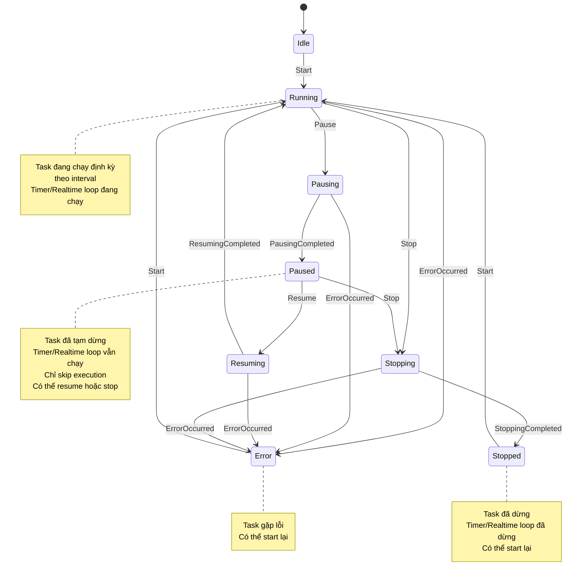
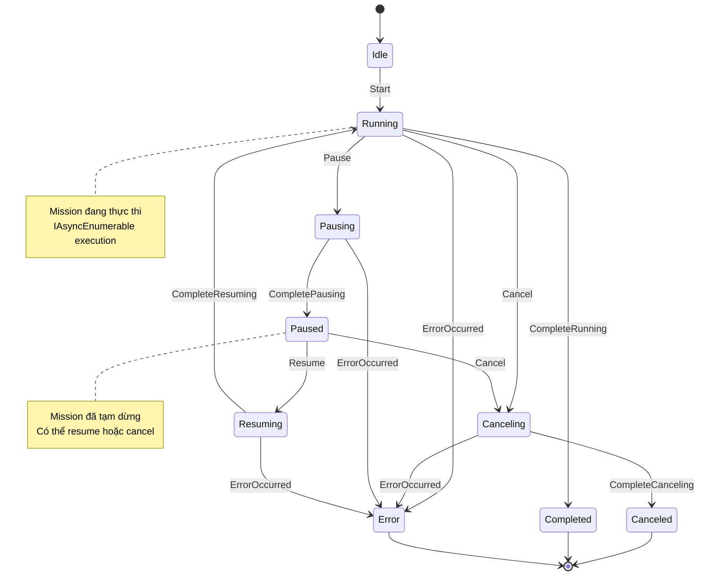
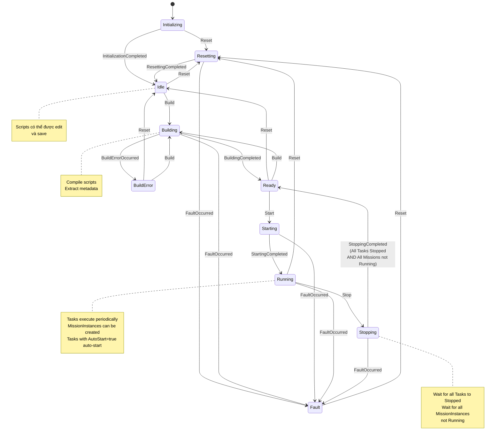
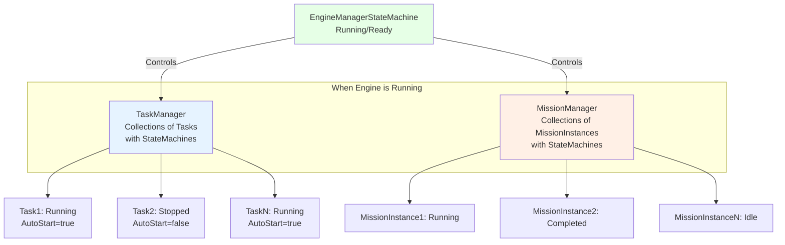

# ScriptEngine State Machine Architecture / Kiến trúc State Machine cho ScriptEngine

##Overview / Tổng quan

Tài liệu này mô tả kiến trúc state machine cho module ScriptEngine sử dụng **Appccelerate.StateMachine**. Module ScriptEngine có 3 state machine chính:

1. **TaskStateMachine** - Quản lý state của Task (periodic execution)
2. **MissionStateMachine** - Quản lý state của Mission (long-running workflow)
3. **EngineManagerStateMachine** - Quản lý state của ScriptEngine Manager

---

##State Machine Definitions / Định nghĩa State Machine

### 1. Task State Machine

#### States / Trạng thái

```csharp
public enum ScriptTaskState
{
    Idle = 0,
    Running,
    Pausing,
    Paused,
    Resuming,
    Stopping,
    Stopped,
    Error,
}
```

#### Triggers / Sự kiện

**Public Triggers** (có thể gọi từ bên ngoài):
- `Start` - Bắt đầu task
- `Pause` - Tạm dừng task (timer tiếp tục chạy, chỉ skip execution)
- `Resume` - Tiếp tục task (timer đã chạy, chỉ enable execution lại)
- `Stop` - Dừng task (dừng timer và cleanup)

**Internal Triggers** (tự động fire khi operation hoàn thành):
- `PausingCompleted` - Hoàn thành quá trình pausing
- `ResumingCompleted` - Hoàn thành quá trình resuming
- `StoppingCompleted` - Hoàn thành quá trình stopping
- `ErrorOccurred` - Xảy ra lỗi

#### State Transition Diagram / Sơ đồ Chuyển đổi Trạng thái



---

**Lưu ý về Task State Machine**:
- Task bắt đầu ở state `Idle`
- Khi ở `Running`, task chạy định kỳ theo interval
- **Pause/Resume Behavior**: 
  - Khi `Pause`: Timer/Realtime loop **vẫn tiếp tục chạy**, chỉ skip execution khi timer expire
  - Khi `Resume`: Timer/Realtime loop **đã chạy**, chỉ enable execution lại
  - Điều này đảm bảo timer không bị gián đoạn và có thể resume ngay lập tức
- Các intermediate states (`Pausing`, `Resuming`, `Stopping`) được sử dụng khi có async operations
- Từ `Stopped` hoặc `Error`, có thể `Start` lại để về `Running` (không cần về `Idle`)
- Task có thể được pause/resume nhiều lần
- Task có thuộc tính `AutoStart` (mặc định `true`) - khi `AutoStart = true`, task sẽ tự động start khi Engine chuyển sang `Running`
- Khi Engine chuyển sang `Stopping`, tất cả Tasks phải stop và về `Stopped`
- **Enable/Disable là API level, Pause/Resume là state machine level**:
  - `Enable()` = `Resume()` - chuyển từ `Paused` → `Resuming` → `Running`
  - `Disable()` = `Pause()` - chuyển từ `Running` → `Pausing` → `Paused`
  - `Stopped` chỉ xảy ra khi Engine stop, không phải khi Disable
- **Dispose**: `Dispose()` method được gọi trực tiếp, không qua state machine trigger. Dispose có thể được gọi từ bất kỳ state nào và sẽ tự động stop task nếu đang running trước khi cleanup

---

### 2. Mission State Machine

#### States / Trạng thái

```csharp
public enum ScriptMissionState
{
    Idle = 0,
    Running,
    Canceling,
    Pausing,
    Paused,
    Resuming,
    Canceled,
    Completed,
    Error,
}
```

#### Triggers / Sự kiện

**Public Triggers**:
- `Start` - Bắt đầu mission
- `Cancel` - Hủy mission
- `Pause` - Tạm dừng mission
- `Resume` - Tiếp tục mission

**Internal Triggers**:
- `CompleteCanceling` - Hoàn thành quá trình canceling
- `CompletePausing` - Hoàn thành quá trình pausing
- `CompleteResuming` - Hoàn thành quá trình resuming
- `CompleteRunning` - Hoàn thành mission (success)
- `ErrorOccurred` - Xảy ra lỗi

#### State Transition Diagram / Sơ đồ Chuyển đổi Trạng thái



---

**Lưu ý về Mission State Machine**:
- **Mission vs MissionInstance**: 
  - `Mission` là method được khai báo trong script với `[Mission]` attribute (không có state machine)
  - `MissionInstance` là instance được tạo từ Mission method khi gọi `CreateMission()` (có state machine)
  - State machine này quản lý state của **MissionInstance**, không phải Mission class
- MissionInstance bắt đầu ở state `Idle`
- Khi ở `Running`, MissionInstance thực thi IAsyncEnumerable workflow
- Có thể pause/resume MissionInstance trong quá trình execution thông qua cơ chế `MoveNext()` của IAsyncEnumerable
- Terminal states (`Completed`, `Canceled`, `Error`) là final states - không thể transition từ đy
- Mỗi MissionInstance chỉ chạy một lần, sau khi complete/cancel/error thì không thể reuse
- Để chạy lại mission, phải tạo MissionInstance mới
- Khi Engine chuyển sang `Stopping`, các MissionInstance đang `Running` sẽ bị cancel và chờ về `Canceled`
- **MissionInstance Lifecycle**: Khi MissionInstance về terminal states (`Completed`, `Canceled`, `Error`):
  1. Lưu trạng thái, log và score vào database
  2. Dispose MissionInstance

---

### 3. Engine Manager State Machine

#### States / Trạng thái

```csharp
public enum ScriptEngineState
{
    Initializing = 0,
    Resetting,
    Idle,
    Building,
    Ready,
    Starting,
    Running,
    Stopping,
    BuildError,
    Fault,
}
```

#### Triggers / Sự kiện

**Public Triggers**:
- `Reset` - Reset engine về Idle
- `Build` - Build scripts
- `Start` - Start engine (enable tasks/missions)
- `Stop` - Stop engine

**Internal Triggers**:
- `InitializationCompleted` - Hoàn thành initialization (tự động chuyển từ Initializing → Idle)
- `ResettingCompleted` - Hoàn thành reset
- `BuildingCompleted` - Hoàn thành build
- `StartingCompleted` - Hoàn thành starting
- `StoppingCompleted` - Hoàn thành stopping
- `BuildErrorOccurred` - Lỗi khi build
- `FaultOccurred` - Lỗi hệ thống

#### State Transition Diagram / Sơ đồ Chuyển đổi Trạng thái



---

**Lưu ý về Engine Manager State Machine**:
- Engine bắt đầu ở state `Initializing` khi khởi động
- Engine tự động chuyển từ `Initializing` sang `Idle` khi initialization hoàn thành
- `Idle`: Scripts có thể được edit và save
- `Building`: Compile scripts và extract metadata (Tasks, Missions, Variables). Khi build thành công, sẽ tạo lại Task và Mission từ compiled scripts
- `Ready`: Scripts đã compiled thành công, sẵn sàng để start. **Không thể edit scripts khi ở Ready**, phải gọi `Reset` để về `Idle` mới edit được
- `Starting`: Khi Engine vào `Starting`, các Task có `AutoStart = true` sẽ bắt đầu start
- `Running`: Tasks và MissionInstances có thể execute. MissionInstance có thể được tạo khi Engine ở `Running`
- `Stopping`: Engine chỉ chuyển sang `Ready` khi **TẤT CẢ** Tasks đã về `Stopped` **VÀ** **TẤT CẢ** MissionInstances không còn ở state `Running`
- `BuildError`: Lỗi khi compile, có thể reset về Idle hoặc build lại
- `Fault`: Lỗi hệ thống nghiêm trọng, cần reset để recovery
- Engine chỉ có thể `Build` từ `Idle` hoặc `BuildError`. Khi `Running`, chỉ có thể gọi `Stop`
- Khi Engine `Reset`, TaskManager và MissionManager sẽ giải phóng (dispose) tất cả Tasks và MissionInstances

---

##Relationships Between State Machines / Mối quan hệ giữa các State Machine

### Hierarchical Relationship / Quan hệ Phân cấp



### State Dependencies / Phụ thuộc Trạng thái

1. **EngineManager → TaskManager**:
   - Tasks chỉ có thể chạy khi Engine ở state `Running`
   - Khi Engine chuyển sang `Stopping`, tất cả Tasks phải stop và về `Stopped`
   - Khi Engine ở `Starting`, các Task có `AutoStart = true` sẽ tự động start
   - Task có thể được Enable/Disable khi Engine ở `Running` (tương đương pause/resume)
   - Khi Engine `Reset`, tất cả Tasks sẽ bị dispose

2. **EngineManager → MissionManager**:
   - MissionInstance chỉ có thể start khi Engine ở state `Running`
   - MissionInstance có thể được tạo khi Engine ở `Running`
   - Khi Engine chuyển sang `Stopping`, các MissionInstance đang `Running` sẽ bị cancel và chờ về `Canceled`
   - Engine chỉ chuyển từ `Stopping` sang `Ready` khi **TẤT CẢ** MissionInstances không còn ở state `Running`
   - Khi Engine `Reset`, tất cả MissionInstances sẽ bị dispose

3. **Task và MissionInstance độc lập**:
   - Tasks và MissionInstances không phụ thuộc trực tiếp vào nhau
   - Chúng có thể tương tác qua Variables và APIs
   - Có thể chạy song song nhiều MissionInstances cùng lúc

4. **Engine Lifecycle**:
   - `Building → Ready`: Tạo lại Task và Mission từ compiled scripts
   - `Starting`: Các Task có `AutoStart = true` bắt đầu start
   - `Stopping → Ready`: Chờ tất cả Tasks về `Stopped` và tất cả MissionInstances không còn `Running`
   - `Reset`: Dispose tất cả Tasks và MissionInstances

---

##Important Clarifications / Làm rõ Quan trọng

### 1. Task Enable/Disable vs Pause/Resume

**Đã làm rõ**:
- `Enable/Disable` là **API level** (public interface cho scripts/users)
- `Pause/Resume` là **state machine level** (internal state transitions)
- `Enable()` = `Resume()` - chuyển từ `Paused` → `Resuming` → `Running`
- `Disable()` = `Pause()` - chuyển từ `Running` → `Pausing` → `Paused`
- Khi Task đang `Running` và bị `Disable()`, sẽ chuyển sang `Pausing` rồi mới về `Paused`
- Khi Task bị `Disable`, state machine sẽ về `Paused` (không phải `Stopped`)
- `Stopped` chỉ xảy ra khi Engine stop, không phải khi Disable

### 2. Mission vs MissionInstance

**Đã làm rõ**:
- `Mission` = method trong script với `[Mission]` attribute (không có state machine)
- `MissionInstance` = instance được tạo từ Mission (có state machine)
- State machine quản lý state của **MissionInstance**, không phải Mission

### 3. Engine Stopping → Ready Transition

**Đã làm rõ**:
- Engine chỉ chuyển từ `Stopping` sang `Ready` khi:
  - **TẤT CẢ** Tasks đã về `Stopped`
  - **VÀ** **TẤT CẢ** MissionInstances không còn ở state `Running`
- Cần implement logic kiểm tra điều kiện này trước khi fire `StoppingCompleted` trigger

### 4. Task AutoStart Behavior

**Đã làm rõ**:
- Task có thuộc tính `AutoStart` (mặc định `true`)
- Khi Engine chuyển sang `Starting`, các Task có `AutoStart = true` sẽ tự động start
- Task có `AutoStart = false` phải manually start

### 5. Engine Building → Ready

**Đã làm rõ**:
- Khi Engine chuyển từ `Building` sang `Ready`, sẽ tạo lại Task và Mission từ compiled scripts
- Các Task và MissionInstance cũ sẽ bị dispose trước đó (khi Engine Reset hoặc khi bắt đầu Building)
- Flow: `Reset` → dispose Tasks/MissionInstances → `Building` → compile scripts → `Ready` → tạo lại Tasks/Missions từ compiled scripts

### 6. Engine Reset Behavior

**Đã làm rõ**:
- Khi Engine `Reset`, TaskManager và MissionManager sẽ dispose tất cả Tasks và MissionInstances
- Engine về `Idle`, scripts có thể được edit

---

##Related Documents / Tài liệu Liên quan

- [ScriptEngine Overview](README.md) - Tổng quan ScriptEngine
- [Tasks](Tasks.md) - Chi tiết về Tasks
- [Missions](Missions.md) - Chi tiết về Missions
- [Compilation](Compilation.md) - Quá trình build scripts

---

**Last Updated**: 2025-01-XX
**Status**: Design Document
**Library**: Appccelerate.StateMachine

