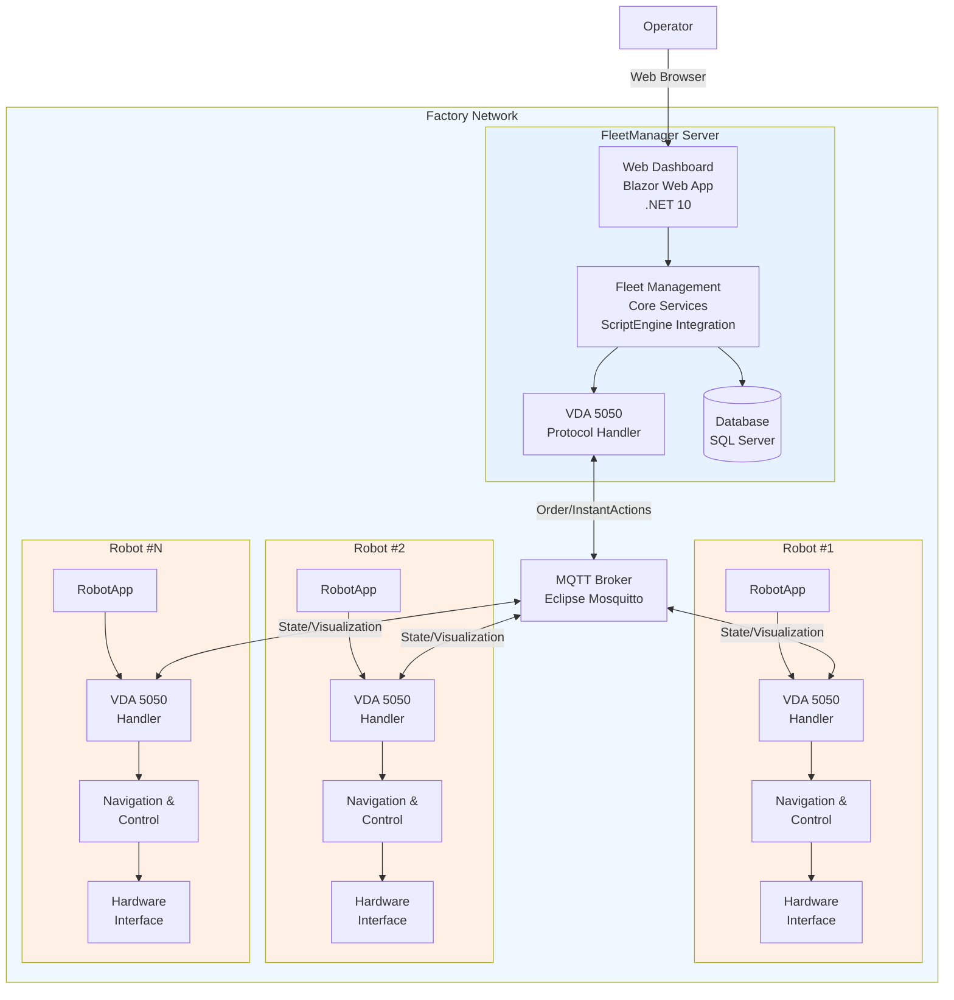
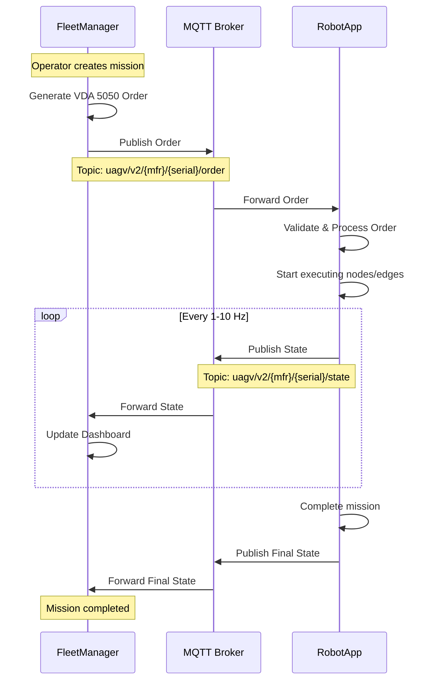
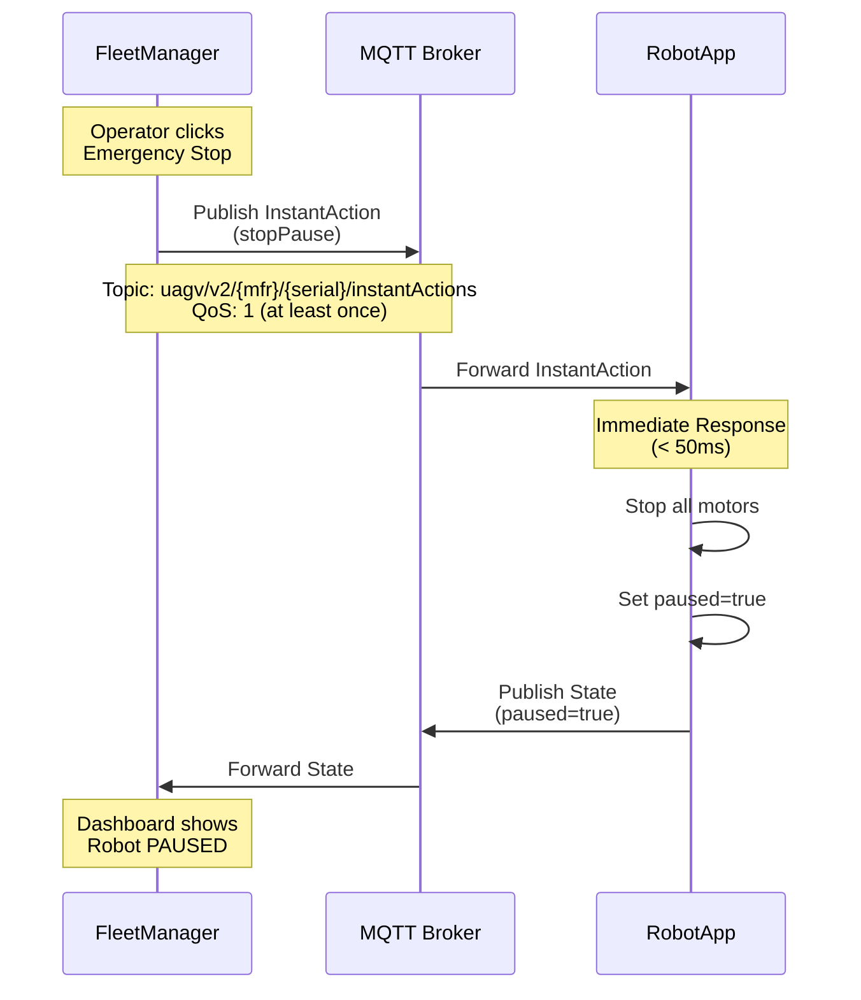
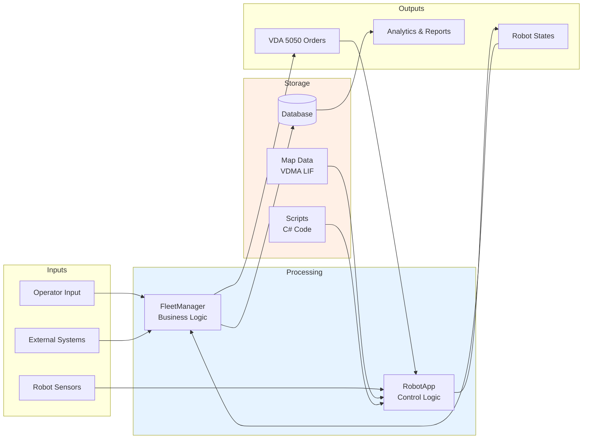
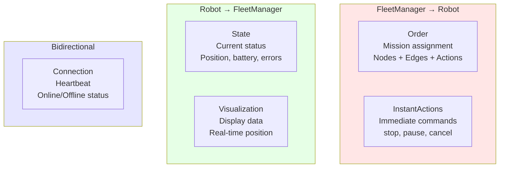
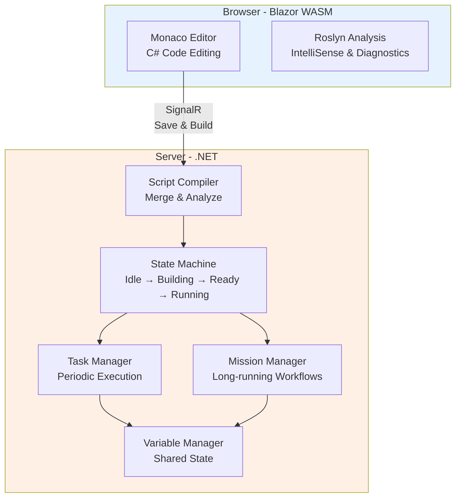
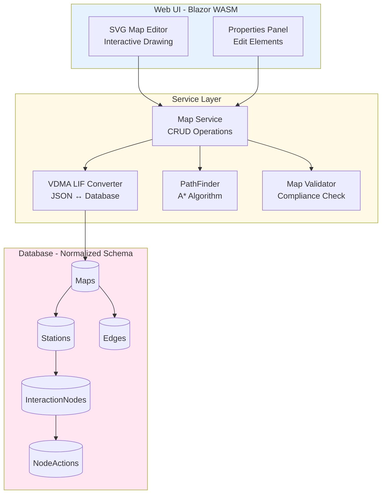
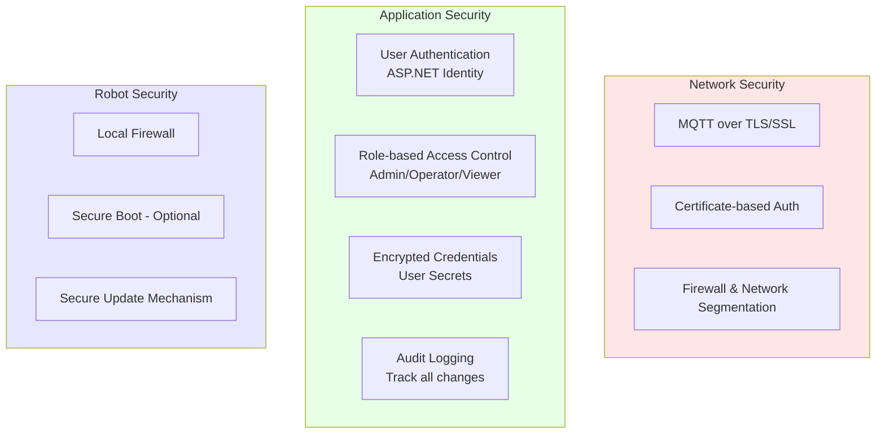
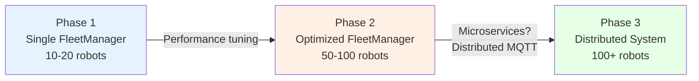

# Architecture Overview / Tổng quan Kiến trúc

## Mục đích / Purpose

Tài liệu này mô tả kiến trúc tổng thể của hệ thống RobotNet10 - một hệ thống quản lý đội xe robot AMR (Autonomous Mobile Robot) tuân thủ tiêu chuẩn VDA 5050.

## Bối cảnh Dự án / Project Context

### Vấn đề Cần Giải quyết

Trong môi trường sản xuất hiện đại (Industry 4.0), các nhà máy cần:
- **Tự động hóa vận chuyển nội bộ**: Di chuyển nguyên vật liệu, sản phẩm giữa các trạm
- **Quản lý nhiều robot**: Điều phối hàng chục đến hàng trăm robot làm việc đồng thời
- **Tương thác với nhiều hệ thống**: Tích hợp với WMS, ERP, MES
- **Linh hoạt và mở rộng**: Dễ dàng thêm robot, thay đổi layout nhà máy

### Giải pháp RobotNet10

RobotNet10 cung cấp:
1. **Hệ thống quản lý đội xe tập trung** (FleetManager) - Điều phối toàn bộ fleet
2. **Phần mềm điều khiển robot** (RobotApp) - Chạy trên từng robot
3. **Tuân thủ VDA 5050** - Tương thác với robot/hệ thống của bên thứ 3
4. **Scripting mạnh mẽ** (ScriptEngine) - Tùy chỉnh hành vi mà không cần rebuild
5. **Quản lý bản đồ** (MapEditor) - Tuân thủ VDMA LIF standard

## Kiến trúc Tổng thể / High-Level Architecture

### Các Thành phần Chính / Core Components

#### 1. FleetManager (Server)
**Vai trò**: Hệ thống điều phối trung tâm
- Quản lý toàn bộ đội xe robot
- Lập kế hoạch nhiệm vụ (mission planning)
- Tối ưu hóa lộ trình
- Giải quyết xung đột giữa robot
- Giao diện web cho operator

**Triển khai**: Server tại nhà máy (Linux/Windows)

#### 2. RobotApp (On Robot)
**Vai trò**: Phần mềm điều khiển robot đơn lẻ
- Nhận lệnh từ FleetManager
- Điều khiển robot di chuyển
- Báo cáo trạng thái
- Xử lý tình huống khẩn cấp
- Giao diện web cấu hình local

**Triển khai**: Máy tính nhúng trên robot (Ubuntu 22.04)

#### 3. MQTT Broker
**Vai trò**: Message broker cho giao tiếp
- Trung gian giữa FleetManager và RobotApps
- Hỗ trợ publish-subscribe pattern
- QoS levels theo VDA 5050
- TLS/SSL security

**Lựa chọn**: Eclipse Mosquitto (recommended)

## Luồng Giao tiếp / Communication Flow

### Quy trình Gán Nhiệm vụ / Order Assignment Flow

### Quy trình Dừng Khẩn cấp / Emergency Stop Flow

## Kiến trúc Dữ liệu / Data Architecture

### Luồng Dữ liệu / Data Flow

### Các Loại Message VDA 5050 / VDA 5050 Message Types

## Module Chi tiết / Detailed Modules

### 1. ScriptEngine (Shared Library)

**Mục đích**: Cho phép tùy chỉnh hành vi mà không cần rebuild app

**Kiến trúc**:

**Use Cases**:
- **RobotApp**: Custom VDA 5050 actions, sensor processing, navigation logic
- **FleetManager**: 
  - Mission planning algorithms (Mission methods tạo MissionInstance)
  - Task execution (periodic tasks)
  - External system integration (HTTP, Modbus TCP, OPC UA, CcLink, ProfileNet, MQTT)
  - FleetManager APIs: `MoveToNode()`, `GetRobotById()`, etc. để tạo VDA 5050 orders

### 2. MapEditor (Shared Library)

**Mục đích**: Quản lý bản đồ nhà máy theo chuẩn VDMA LIF

**Kiến trúc**:

**Tính năng**:
- Import/Export VDMA LIF JSON
- Visual editing với SVG canvas
- Lưu trữ map data trong database (SQL Server cho FleetManager, SQLite cho RobotApp)
- PathFinding giữa các stations (A* algorithm)
- FleetManager sử dụng map data từ database để tính toán routes

## Nguyên tắc Thiết kế / Design Principles

### 1. Interoperability / Khả năng Tương tác

**Tại sao quan trọng**: Cho phép làm việc với robot/hệ thống của hãng khác

**Cách thực hiện**:
- ✅ Tuân thủ nghiêm ngặt VDA 5050 v2.1.0 (tương thích ngược với v2.0.0)
- ✅ Tuân thủ VDMA LIF cho map format
- ✅ Sử dụng MQTT standard protocol
- ✅ JSON serialization với camelCase naming

### 2. Modularity / Tính Mô-đun

**Tại sao quan trọng**: Dễ bảo trì, mở rộng, test

**Cách thực hiện**:
- ✅ Clean Architecture layers
- ✅ Dependency Injection
- ✅ Interface-based design
- ✅ Shared libraries (ScriptEngine, MapEditor)

### 3. Reliability / Độ Tin cậy

**Tại sao quan trọng**: Hệ thống sản xuất không được gián đoạn

**Cách thực hiện**:
- ✅ MQTT QoS levels (0, 1 theo message type)
- ✅ Auto-reconnection logic
- ✅ Graceful degradation
- ✅ Comprehensive error handling
- ✅ Safety monitoring (emergency stop < 50ms)

### 4. Scalability / Khả năng Mở rộng

**Tại sao quan trọng**: Hỗ trợ từ vài robot đến 100+ robot

**Cách thực hiện**:
- ✅ Asynchronous processing (async/await)
- ✅ Efficient database queries (indexes)
- ✅ State-less service design
- ✅ MQTT broker clustering (if needed)

### 5. Maintainability / Dễ Bảo trì

**Tại sao quan trọng**: Giảm chi phí vận hành dài hạn

**Cách thực hiện**:
- ✅ Clear code organization
- ✅ Comprehensive documentation
- ✅ Unit & integration tests
- ✅ Structured logging
- ✅ CI/CD pipeline

## Quyết định Công nghệ / Technology Choices

### Tại sao .NET 10?

| Tiêu chí | Lý do |
|----------|-------|
| **Cross-platform** | Chạy trên Linux (robot) và Windows/Linux (server) |
| **Performance** | High-performance runtime, native compilation option |
| **Ecosystem** | Rich libraries: MQTTnet, EF Core, SignalR |
| **Type Safety** | C# strong typing giảm bugs |
| **Tooling** | Visual Studio, VS Code, JetBrains Rider |

### Tại sao Blazor?

| Tiêu chí | Lý do |
|----------|-------|
| **Full-stack C#** | Một ngôn ngữ cho cả backend và frontend |
| **WebAssembly** | Client-side execution (Monaco Editor, Roslyn) |
| **SignalR Integration** | Real-time updates dễ dàng |
| **Component Model** | Reusable UI components |

### Tại sao MQTT?

| Tiêu chí | Lý do |
|----------|-------|
| **Lightweight** | Low overhead cho IoT/robotics |
| **Pub-Sub Pattern** | Perfect cho 1-to-many communication |
| **QoS Levels** | Reliable delivery options |
| **VDA 5050 Requirement** | Standard chỉ định MQTT |
| **Industry Standard** | Widely supported, mature ecosystem |

### Tại sao SQL Server cho FleetManager?

| Tiêu chí | Lý do |
|----------|-------|
| **Enterprise Features** | Advanced features cho fleet management |
| **Performance** | Excellent for complex queries và analytics |
| **JSON Support** | Store VDA 5050 messages, VDMA LIF data |
| **Reliability** | ACID compliance, proven stability |
| **Integration** | Tích hợp tốt với .NET ecosystem |

**Lưu ý**: RobotApp sử dụng SQLite cho local storage.

## Yêu cầu Hiệu năng / Performance Requirements

### Real-time Requirements

| Thao tác | Yêu cầu | Lý do |
|----------|---------|-------|
| **Emergency Stop** | < 50ms | An toàn con người |
| **Order Processing** | < 100ms | Responsive system |
| **State Update** | 1-10 Hz | Real-time monitoring |
| **Navigation Loop** | 10-50 Hz | Smooth motion control |
| **MQTT Latency** | < 50ms | VDA 5050 recommendation |

### Scalability Requirements

| Chỉ số | Mục tiêu | Ghi chú |
|--------|----------|---------|
| **Max Robots** | 100+ | Per FleetManager instance |
| **State Processing** | < 50ms | Per robot state message |
| **Dashboard Update** | < 100ms | Via SignalR real-time |
| **Database Query** | < 200ms | Average response time |
| **Mission Planning** | < 2 seconds | Route optimization |

## Kiến trúc Bảo mật / Security Architecture

## Tương lai / Future Considerations

### Potential Enhancements

1. **Multi-fleet Support**: Nhiều FleetManager instances cho nhà máy lớn
2. **AI-based Optimization**: Machine learning cho route optimization
3. **Predictive Maintenance**: Dự đoán lỗi dựa trên telemetry data
4. **Cloud Integration**: Backup data, remote monitoring
5. **Mobile App**: iOS/Android app cho operators
6. **REST API**: Third-party integration via REST

### Scalability Roadmap

## Related Documents / Tài liệu Liên quan

### Kiến trúc Chi tiết / Detailed Architecture
- [ScriptEngine Architecture](../ScriptEngine/README.md) - Web-based C# scripting system
- [MapEditor Architecture](../MapEditor/README.md) - VDMA LIF map management
- [RobotApp Architecture](../robotapp/README.md) - Robot control application
- [FleetManager Architecture](../fleetmanager/README.md) - Fleet management system

### Tiêu chuẩn / Standards
- [VDA 5050 Implementation](../vda5050/README.md) - VDA 5050 protocol details

### Phát triển / Development
- [AI Collaboration Guide](../ai-guide/README.md) - For AI agents working on this project

---

**Last Updated**: 2026-03-15
**Status**: Architecture Design Document
**Version**: 1.0
