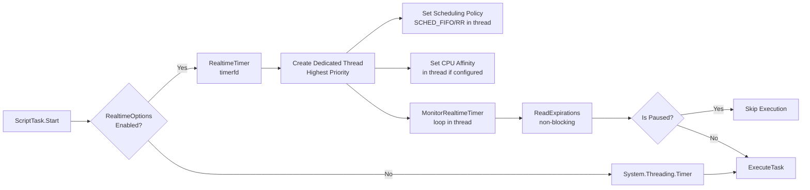

# Realtime Integration Guide / Hướng dẫn Tích hợp Realtime

## Overview / Tổng quan

Tài liệu này mô tả cách tích hợp tính năng Linux realtime (preempt_rt) vào ScriptTask và cách enable/disable tính năng này ở compile time.

## Enabling Realtime Support / Bật Hỗ trợ Realtime

### Step 1: Uncomment DefineConstants / Bỏ comment DefineConstants

Trong file `RobotNet10.ScriptEngine.csproj`, uncomment dòng sau:

```xml
<PropertyGroup>
  <TargetFramework>net10.0</TargetFramework>
  <ImplicitUsings>enable</ImplicitUsings>
  <Nullable>enable</Nullable>
  <!-- Define REALTIME symbol to enable Linux realtime features -->
  <DefineConstants>$(DefineConstants);REALTIME</DefineConstants>
</PropertyGroup>
```

### Step 2: Build Project / Build Dự án

```bash
dotnet build srcs/RobotNet10/Commons/RobotNet10.ScriptEngine/RobotNet10.ScriptEngine.csproj
```

Khi `REALTIME` symbol được define:
- Code realtime sẽ được compile vào binary
- ScriptTask sẽ sử dụng `RealtimeTimer` thay vì `System.Threading.Timer`
- Có thể configure realtime scheduling policy và CPU affinity

Khi `REALTIME` symbol **KHÔNG** được define:
- Code realtime sẽ bị loại bỏ hoàn toàn (không compile)
- ScriptTask sử dụng `System.Threading.Timer` (standard .NET timer)
- Không có dependency vào Linux-specific APIs

## Usage Examples / Ví dụ Sử dụng

### Example 1: Basic Realtime Task / Task Realtime Cơ bản

```csharp
using RobotNet10.ScriptEngine.Models;
using Microsoft.CodeAnalysis.Scripting;

// Create ScriptTaskModel with compiled script runner
var taskModel = new ScriptTaskModel(
    name: "HighPriorityTask",
    interval: 1, // 1 second
    autoStart: true,
    code: scriptCode,
    runner: compiledScriptRunner
);

// Create ScriptGlobals with dictionaries
var globals = new ScriptGlobals(
    scriptRobotNet: robotNetGlobals,
    scriptApp: appGlobals,
    scriptVariables: variables,
    scriptParameters: parameters
);

// Create task with realtime options
var realtimeOptions = new RealtimeTaskOptions
{
    Enabled = true,
    SetSchedulingPolicy = true,
    SchedulingPolicy = RealtimeSchedulingPolicy.Fifo,
    Priority = 50,
    ClockType = RealtimeClockType.Monotonic
};

var task = new ScriptTask(
    model: taskModel,
    globals: globals,
    realtimeOptions: realtimeOptions
);
```

### Example 2: Task with CPU Affinity / Task với CPU Affinity

```csharp
var taskModel = new ScriptTaskModel(
    name: "PinnedTask",
    interval: 2,
    autoStart: true,
    code: scriptCode,
    runner: compiledScriptRunner
);

var globals = new ScriptGlobals(
    scriptRobotNet: robotNetGlobals,
    scriptApp: appGlobals,
    scriptVariables: variables,
    scriptParameters: parameters
);

var realtimeOptions = new RealtimeTaskOptions
{
    Enabled = true,
    SetSchedulingPolicy = true,
    SchedulingPolicy = RealtimeSchedulingPolicy.Fifo,
    Priority = 75,
    CpuAffinity = new[] { 0, 1 }, // Pin to CPU 0 and 1
    ClockType = RealtimeClockType.Monotonic
};

var task = new ScriptTask(
    model: taskModel,
    globals: globals,
    realtimeOptions: realtimeOptions
);
```

### Example 3: Disable Realtime for Specific Task / Tắt Realtime cho Task Cụ thể

```csharp
var taskModel = new ScriptTaskModel(
    name: "StandardTask",
    interval: 5,
    autoStart: true,
    code: scriptCode,
    runner: compiledScriptRunner
);

var globals = new ScriptGlobals(
    scriptRobotNet: robotNetGlobals,
    scriptApp: appGlobals,
    scriptVariables: variables,
    scriptParameters: parameters
);

var realtimeOptions = new RealtimeTaskOptions
{
    Enabled = false // Use standard timer even if REALTIME is defined
};

var task = new ScriptTask(
    model: taskModel,
    globals: globals,
    realtimeOptions: realtimeOptions
);
```

### Example 4: Without Realtime Options / Không có Realtime Options

```csharp
var taskModel = new ScriptTaskModel(
    name: "StandardTask",
    interval: 10,
    autoStart: true,
    code: scriptCode,
    runner: compiledScriptRunner
);

var globals = new ScriptGlobals(
    scriptRobotNet: robotNetGlobals,
    scriptApp: appGlobals,
    scriptVariables: variables,
    scriptParameters: parameters
);

// If realtimeOptions is null or not provided, uses standard timer
var task = new ScriptTask(
    model: taskModel,
    globals: globals
    // realtimeOptions: null (default)
);
```

## RealtimeTaskOptions Configuration / Cấu hình RealtimeTaskOptions

| Property | Type | Default | Description |
|----------|------|---------|-------------|
| `Enabled` | `bool` | `true` | Enable/disable realtime features for this task |
| `SetSchedulingPolicy` | `bool` | `true` | Whether to set realtime scheduling policy |
| `SchedulingPolicy` | `RealtimeSchedulingPolicy` | `Fifo` | SCHED_FIFO or SCHED_RR |
| `Priority` | `int` | `50` | Priority (1-99, higher = higher priority) |
| `CpuAffinity` | `int[]?` | `null` | CPU cores to pin thread to (null = no affinity) |
| `ClockType` | `RealtimeClockType` | `Monotonic` | Clock type for timer (Monotonic recommended) |
| `NonBlocking` | `bool` | `false` | **Note**: Always set to `true` internally for async monitoring |

## How It Works / Cách Hoạt động

### Without REALTIME Symbol / Không có REALTIME Symbol


### With REALTIME Symbol / Có REALTIME Symbol



## Key Features / Tính năng Chính

### 1. High-Resolution Timer / Timer Độ phân giải Cao

- **RealtimeTimer**: Sử dụng Linux `timerfd` API
- **Accuracy**: Nanosecond precision
- **Better than**: `System.Threading.Timer` (millisecond precision)

### 2. Dedicated Thread with Highest Priority / Thread Riêng với Độ Ưu tiên Cao nhất

- **Dedicated Thread**: Tạo thread riêng cho realtime monitoring với `IsBackground = false`
- **Thread Priority**: Set SCHED_FIFO/SCHED_RR với priority cao nhất trong thread
- **Isolation**: Realtime monitoring chạy độc lập, không bị ảnh hưởng bởi các thread khác
- **CPU Affinity**: Pin thread to specific CPU cores (nếu configured)
- **Reduces cache misses**: Improves determinism

### 3. Real-time Scheduling / Lập lịch Real-time

- **SCHED_FIFO**: First-In-First-Out, highest priority threads run first
- **SCHED_RR**: Round-Robin, time-sliced real-time scheduling
- **Priority**: 1-99 (higher = higher priority)
- **Applied in thread**: Scheduling policy được set trong dedicated thread, không ảnh hưởng main thread

### 4. Pause/Resume Behavior / Hành vi Pause/Resume

- **Timer continues**: Khi paused, timer/realtime loop vẫn tiếp tục chạy
- **Skip execution**: Chỉ skip execution khi timer expire (check `_isPaused` flag)
- **Instant resume**: Resume ngay lập tức không cần restart timer
- **No interruption**: Timer không bị gián đoạn khi pause/resume

### 5. ScriptTask Constructor / Constructor của ScriptTask

- **ScriptTaskModel**: Nhận model chứa metadata và `ScriptRunner<object>`
- **ScriptGlobals**: Nhận globals dictionary với ScriptRobotNet, ScriptApp, ScriptVariables, ScriptParameters
- **Logger**: Tự động lấy từ `globals.ScriptRobotNet.TryGetValue("get_Logger", ...)`
- **Execution**: Gọi `model.Runner(globals)` trực tiếp, không merge dictionaries

### 6. Fallback Mechanism / Cơ chế Dự phòng

- Nếu realtime initialization fails, falls back to standard timer
- Logs error but continues operation
- Ensures system reliability

## ⚠️ Important Notes / Lưu Ý Quan trọng

### 1. Root Privileges / Quyền Root

Realtime scheduling requires root privileges or capabilities:

```bash
# Option 1: Run with sudo
sudo dotnet run

# Option 2: Set capabilities (recommended for production)
sudo setcap cap_sys_nice+ep /path/to/your/app
```

### 2. Platform Specific / Phụ thuộc Nền tảng

- **Only works on Linux**: Realtime features require Linux kernel
- **preempt_rt recommended**: For best real-time performance
- **Windows/macOS**: Code compiles but realtime features are disabled

### 3. Performance Considerations / Xem xét Hiệu năng

- **RealtimeTimer**: More accurate but requires Linux
- **Standard Timer**: Cross-platform but less accurate
- **Choose based on**: Target platform and accuracy requirements

### 4. Error Handling / Xử lý Lỗi

- Realtime initialization errors are caught and logged
- System automatically falls back to standard timer
- Task continues to function normally

## Comparison / So sánh

| Feature | Standard Timer | Realtime Timer |
|---------|---------------|----------------|
| **Platform** | Cross-platform | Linux only |
| **Accuracy** | ~1ms | Nanosecond |
| **Scheduling** | OS default | SCHED_FIFO/RR |
| **CPU Affinity** | No | Yes |
| **Root Required** | No | Yes (for scheduling) |
| **Compile-time** | Always available | Requires REALTIME symbol |

## Related Documents / Tài liệu Liên quan

- RobotNet10.Realtime README (`srcs/RobotNet10/Commons/RobotNet10.Realtime/README.md`) - Realtime library documentation
- [Appccelerate.StateMachine Guide](AppccelerateStateMachine.md) - State machine usage
- ScriptTask Implementation (`srcs/RobotNet10/Commons/RobotNet10.ScriptEngine/Models/ScriptTask.cs`) - Reference implementation

---

**Last Updated**: 2025-11-13
**Status**: Integration Guide
**Version**: 1.0

