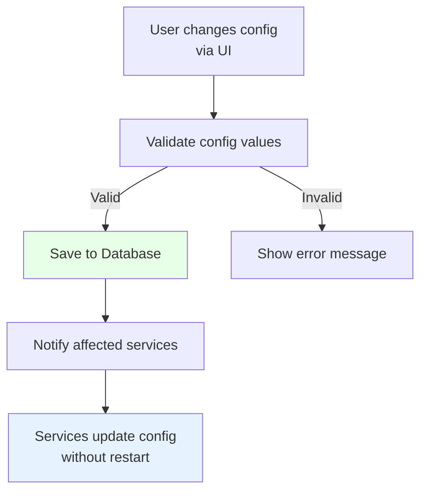

# FleetManagerConfig Module / Module Cấu hình

## Overview / Tổng quan

FleetManagerConfig Module quản lý cấu hình động cho hệ thống, cho phép thay đổi cấu hình runtime mà không cần restart.

## Mục đích / Purpose

Quản lý các tham số cấu hình cho hệ thống, cho phép thay đổi runtime và lưu trữ trong database.

## Chức năng chính / Main Features

- Quản lý cấu hình động cho các services
- Thay đổi cấu hình runtime (không cần restart)
- Lưu trữ cấu hình trong database (thay vì chỉ dùng appsettings.json)
- UI để config các tham số hệ thống

## Cấu hình bao gồm / Configuration Includes

- MQTT broker connection settings
- Database connection strings
- System parameters (timeouts, intervals, etc.)
- Map settings
- ScriptEngine settings
- TrafficControl parameters
- RobotManager settings

## Cấu hình Runtime / Runtime Configuration

## Config Storage / Lưu trữ Cấu hình

- Primary: Database (SQL Server)
- Fallback: appsettings.json (cho initial setup)
- Services đọc config từ database thay vì appsettings.json

## UI Features / Tính năng Giao diện

- Web UI để config các tham số
- Validation khi thay đổi config
- Real-time update cho các services
- Config history (optional)

## Related Documents / Tài liệu Liên quan

- [FleetManager Overview](README.md) - Tổng quan FleetManager
- [Identity Module](Identity.md) - Quản lý permissions cho config access

---

**Last Updated**: 2025-11-13

