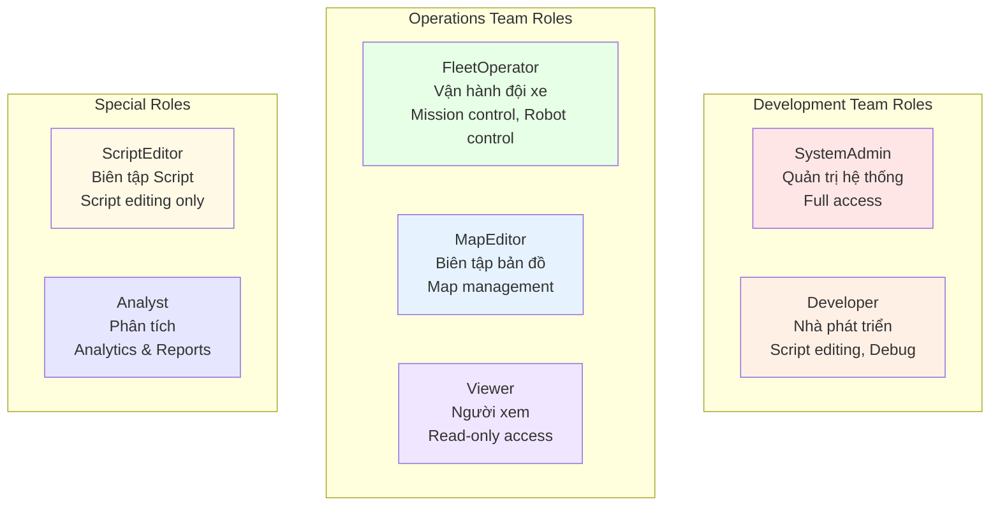

# Identity Module / Module Xác thực

## Overview / Tổng quan

Identity Module quản lý authentication và authorization cho FleetManager, đảm bảo người dùng có quyền truy cập phù hợp với vai trò của họ.

## Mục đích / Purpose

- User authentication (Individual Account - ASP.NET Identity)
- Role-based access control (RBAC)
- Permission management
- User management

## 👥 Roles được định nghĩa / Defined Roles

## Permissions Matrix / Ma trận Quyền

| Feature | SystemAdmin | Developer | FleetOperator | MapEditor | ScriptEditor | Analyst | Viewer |
|---------|-------------|-----------|---------------|-----------|--------------|---------|--------|
| System Config | ✅ | ❌ | ❌ | ❌ | ❌ | ❌ | ❌ |
| User Management | ✅ | ❌ | ❌ | ❌ | ❌ | ❌ | ❌ |
| Script Editing | ✅ | ✅ | ❌ | ❌ | ✅ | ❌ | ❌ |
| Mission Control | ✅ | ✅ | ✅ | ❌ | ❌ | ❌ | ❌ |
| Robot Control | ✅ | ✅ | ✅ | ❌ | ❌ | ❌ | ❌ |
| Map Editing | ✅ | ✅ | ❌ | ✅ | ❌ | ❌ | ❌ |
| Analytics | ✅ | ✅ | ✅ | ❌ | ❌ | ✅ | ✅ |
| View Dashboard | ✅ | ✅ | ✅ | ✅ | ✅ | ✅ | ✅ |

## Multi-tenant Support / Hỗ trợ Đa Tenant

- Mỗi nhà máy có FleetManager instance riêng trên server local
- Nhiều khu vực trong nhà máy có thể dùng chung FleetManager nếu robot di chuyển qua lại giữa các khu vực

## Related Documents / Tài liệu Liên quan

- [FleetManager Overview](README.md) - Tổng quan FleetManager
- [Architecture Overview](../architecture/README.md) - Kiến trúc hệ thống

---

**Last Updated**: 2025-11-13

