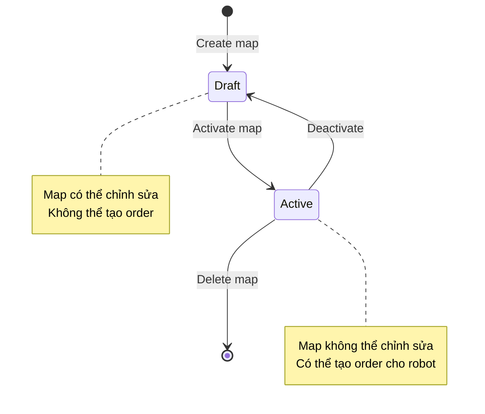

# MapEditor Module / Module Quản lý Bản đồ

## Overview / Tổng quan

MapEditor Module quản lý bản đồ nhà máy theo tiêu chuẩn VDMA LIF, cho phép tạo, chỉnh sửa và quản lý maps cho robot navigation.

## Mục đích / Purpose

Quản lý bản đồ nhà máy theo tiêu chuẩn VDMA LIF để hỗ trợ robot navigation và route planning.

## Kiến trúc / Architecture

- **Shared Library**: MapEditor là shared library cho FleetManager và RobotApp
- **Components**: 
  - C# Library: Xử lý logic (map data, pathfinding, validation)
  - Blazor Library: UI components (shared cho FleetManager và RobotApp)

## Chức năng chính / Main Features

- Tạo và chỉnh sửa maps
- Import/Export VDMA LIF JSON
- Visual editing với SVG canvas
- PathFinding giữa các stations (A* algorithm)
- Validate map data theo VDMA LIF standard
- Quản lý stations, nodes, edges

## Map States / Trạng thái Bản đồ

## Map Activation Rules / Quy tắc Kích hoạt Bản đồ

- Map ở trạng thái **Draft**: Có thể chỉnh sửa, không thể tạo order
- Map ở trạng thái **Active**: Không thể chỉnh sửa, có thể tạo order cho robot
- **FleetManager**: Có thể active nhiều maps cùng lúc
- **RobotApp**: Chỉ active 1 map tại một thời điểm

## Data Storage / Lưu trữ Dữ liệu

- Map data lưu trong SQL Server database (FleetManager)
- MapEditor sử dụng dữ liệu từ database để tính toán routes

## ✅ VDMA LIF Compliance / Tuân thủ VDMA LIF

- Import/Export VDMA LIF JSON format
- Validate map structure theo VDMA LIF standard
- Cấu trúc dữ liệu có thể thể hiện được theo tiêu chuẩn VDMA LIF

## Related Documents / Tài liệu Liên quan

- [FleetManager Overview](README.md) - Tổng quan FleetManager
- [TrafficControl Module](TrafficControl.md) - Sử dụng map data để tính toán routes
- [MapEditor Documentation](../MapEditor/README.md) - Chi tiết về MapEditor shared library

---

**Last Updated**: 2025-11-13

