# FleetManager Documentation / Tài liệu FleetManager

## Overview / Tổng quan

FleetManager là hệ thống quản lý và điều phối đội xe robot AMR, chạy trên server tại nhà máy. Ứng dụng này giám sát, điều phối nhiều robot AMR, gán nhiệm vụ, tối ưu hóa lộ trình và cung cấp giao diện web cho người vận hành.

## Bối cảnh & Mục tiêu / Context & Goals

### Vấn đề Cần Giải quyết

Trong môi trường sản xuất hiện đại:
- **Quản lý nhiều robot**: Điều phối hàng chục đến hàng trăm robot làm việc đồng thời
- **Tối ưu hóa hiệu quả**: Giảm thời gian chờ, tối ưu lộ trình, cn bằng tải
- **Giải quyết xung đột**: Tránh deadlock, collision giữa các robot
- **Giám sát real-time**: Theo dõi trạng thái và hiệu suất của từng robot
- **Tích hợp hệ thống**: Kết nối với WMS, ERP, MES và các hệ thống khác

### Giải pháp FleetManager

FleetManager cung cấp:
1. **Fleet Coordination** - Điều phối tập trung toàn bộ đội xe
2. **Mission Planning** - Lập kế hoạch và quản lý nhiệm vụ thông minh
3. **Route Optimization** - Tối ưu hóa lộ trình dựa trên nhiều tiêu chí
4. **Conflict Resolution** - Tự động giải quyết xung đột giữa robot
5. **Real-time Monitoring** - Giám sát và phân tích hiệu suất
6. **Web Dashboard** - Giao diện trực quan cho operators

## Kiến trúc Tổng thể / System Architecture

### High-Level Architecture

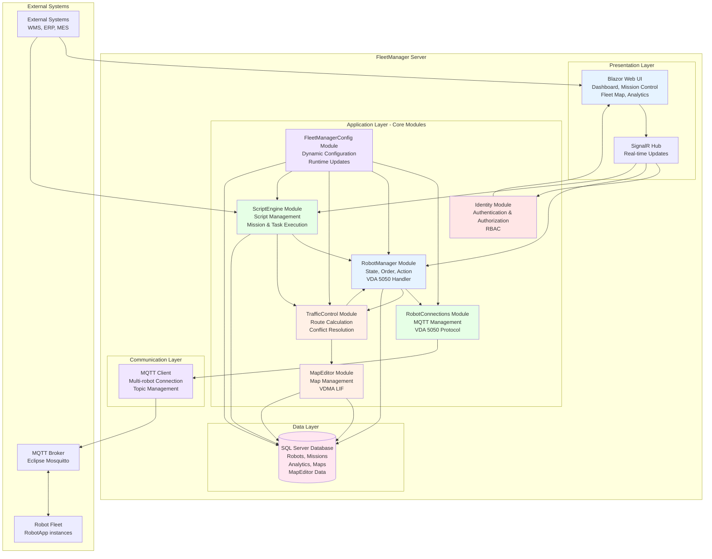

### Component Interaction Flow

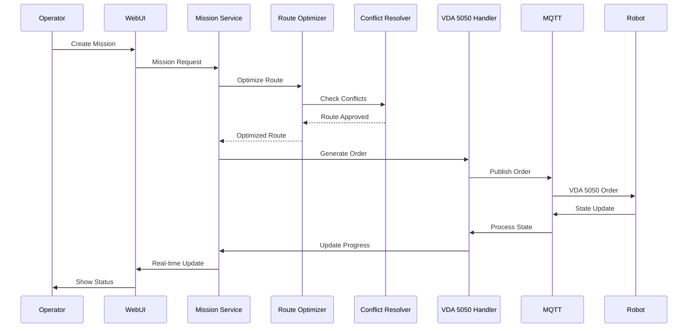

## Cấu trúc Tài liệu / Documentation Structure

Tài liệu FleetManager được tổ chức thành các module riêng biệt để dễ dàng tra cứu và bảo trì:

```
docs/fleetmanager/
├── README.md                    # File này - Tổng quan FleetManager
├── Identity.md                  # Module Xác thực và Phân quyền
├── MapEditor.md                 # Module Quản lý Bản đồ
├── RobotConnections.md          # Module Kết nối Robot
├── RobotManager.md              # Module Quản lý Robot
├── TrafficControl.md            # Module Điều khiển Giao thông
├── ScriptEngine.md              # Module Script Engine
└── FleetManagerConfig.md        # Module Cấu hình
```

## Core Modules / Các Module Chính

FleetManager được tổ chức thành 7 module chính, mỗi module có trách nhiệm cụ thể:

### 1. [Identity Module](Identity.md) - Module Xác thực và Phân quyền

Quản lý authentication và authorization cho FleetManager với 7 roles (SystemAdmin, Developer, FleetOperator, MapEditor, Viewer, ScriptEditor, Analyst).

**[Xem chi tiết →](Identity.md)**

### 2. [MapEditor Module](MapEditor.md) - Module Quản lý Bản đồ

Quản lý bản đồ nhà máy theo tiêu chuẩn VDMA LIF. Shared library cho FleetManager và RobotApp với visual editing và pathfinding.

**[Xem chi tiết →](MapEditor.md)**

### 3. [RobotConnections Module](RobotConnections.md) - Module Kết nối Robot

Quản lý kết nối MQTT của các robot theo VDA 5050. MQTT Broker chạy trên service ngoài FleetManager.

**[Xem chi tiết →](RobotConnections.md)**

### 4. [RobotManager Module](RobotManager.md) - Module Quản lý Robot

Quản lý state, order, và action của robots. Cung cấp APIs cho ScriptEngine và xử lý VDA 5050 protocol.

**[Xem chi tiết →](RobotManager.md)**

### 5. [TrafficControl Module](TrafficControl.md) - Module Điều khiển Giao thông

Tính toán route cho order, phát hiện conflict và giải quyết xung đột. Quản lý base và horizon của VDA 5050 orders.

**[Xem chi tiết →](TrafficControl.md)**

### 6. [ScriptEngine Module](ScriptEngine.md) - Module Script Engine

Quản lý script do người dùng thiết kế, chạy Task và Mission. Shared library với IntelliSense support và FleetManager APIs.

**[Xem chi tiết →](ScriptEngine.md)**

### 7. [FleetManagerConfig Module](FleetManagerConfig.md) - Module Cấu hình

Quản lý cấu hình động cho hệ thống, cho phép thay đổi runtime mà không cần restart. Lưu trữ trong database.

**[Xem chi tiết →](FleetManagerConfig.md)**

## 📡 VDA 5050 Protocol Handler

**Mục đích**: Xử lý giao tiếp VDA 5050 với các robot (không phải module riêng, mà là phần của RobotManager và RobotConnections).

**Chức năng**:
- **Order Generation**: Tạo VDA 5050 orders từ TrafficControl
- **Order Updates**: Tạo OrderUpdate (cùng orderId, orderUpdateId tăng) khi TrafficControl yêu cầu
- **State Processing**: Xử lý state messages từ robots (chỉ quản lý state hiện tại, không lưu history)
- **Action Generation**: Tạo instant actions (stopPause, cancelOrder, etc.)
- **Message Validation**: Validate VDA 5050 messages

**Lưu ý**: VDA 5050 Protocol Handler không phải là module riêng, mà là chức năng được tích hợp trong RobotManager và RobotConnections modules.

### 6. Analytics & Reporting

**Mục đích**: Thu thập, phân tích và báo cáo dữ liệu vận hành.

**Metrics theo dõi**:

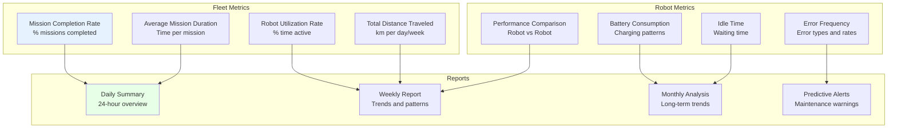

### 7. Web Dashboard (Blazor)

**Mục đích**: Giao diện web cho operators.

**Technology Stack**:
- **Blazor Web App**: .NET 10
- **Authentication**: Individual Account (ASP.NET Identity)
- **Real-time**: SignalR for live updates
- **Script Editor**: Monaco Editor với ScriptEngine integration

**Các trang chính**:

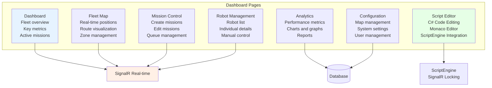

**Script Editor Features**:
- Monaco Editor với C# IntelliSense
- SignalR-based file locking: Khi user đang edit, các session khác không được sửa file
- Save action: Không có realtime update file content, chỉ khi user gọi action Save mới gửi lên server
- ScriptEngine quản lý trạng thái cho phép chỉnh sửa hay không

## 📡 Communication Architecture / Kiến trúc Giao tiếp

### MQTT Topic Structure

```mermaid
graph TB
    subgraph "Published Topics<br/>FleetManager → Robots"
        OrderTopic[uagv/v2/{manufacturer}/{serialNumber}/order<br/>QoS: 1, Retain: false]
        InstantTopic[uagv/v2/{manufacturer}/{serialNumber}/instantActions<br/>QoS: 1, Retain: false]
    end
    
    subgraph "Subscribed Topics<br/>Robots → FleetManager"
        StateTopic[uagv/v2/{manufacturer}/+/state<br/>QoS: 0, Retain: true]
        VizTopic[uagv/v2/{manufacturer}/+/visualization<br/>QoS: 0, Retain: false]
        ConnTopic[uagv/v2/{manufacturer}/+/connection<br/>QoS: 1, Retain: true]
    end
    
    FleetMgr[FleetManager] --> OrderTopic
    FleetMgr --> InstantTopic
    StateTopic --> FleetMgr
    VizTopic --> FleetMgr
    ConnTopic --> FleetMgr
    
    style FleetMgr fill:#e6f3ff
    style OrderTopic fill:#fff0e6
    style StateTopic fill:#e6ffe6
```

### Message Flow Patterns

**Order Assignment Flow**:

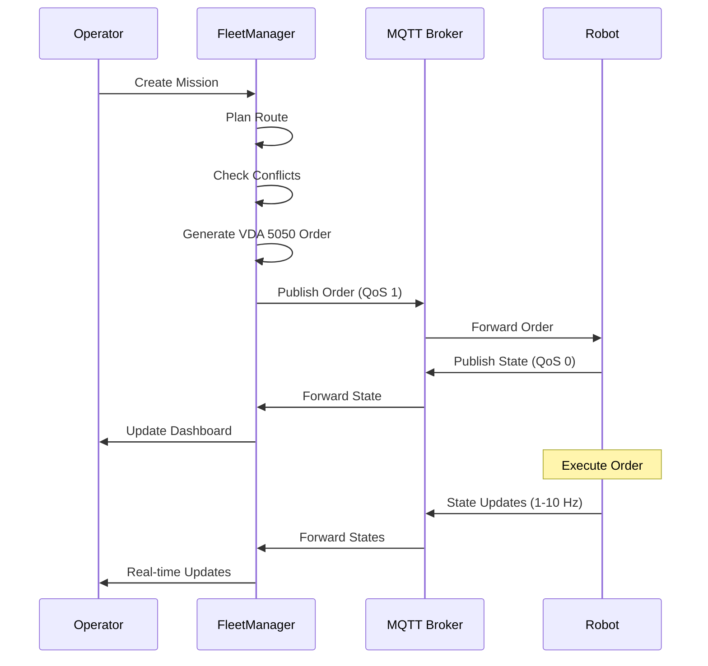

**Emergency Stop Flow**:

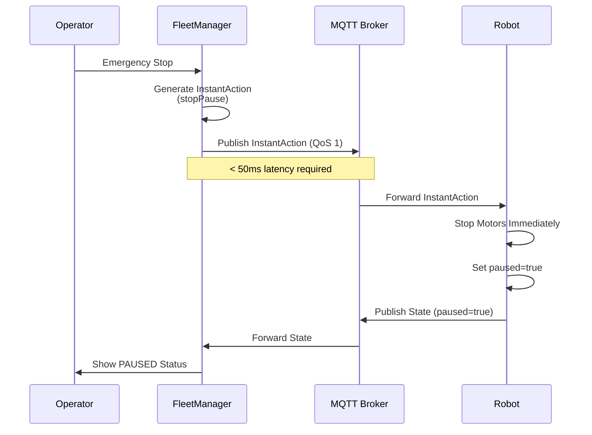

## Data Architecture / Kiến trúc Dữ liệu

### Core Entities

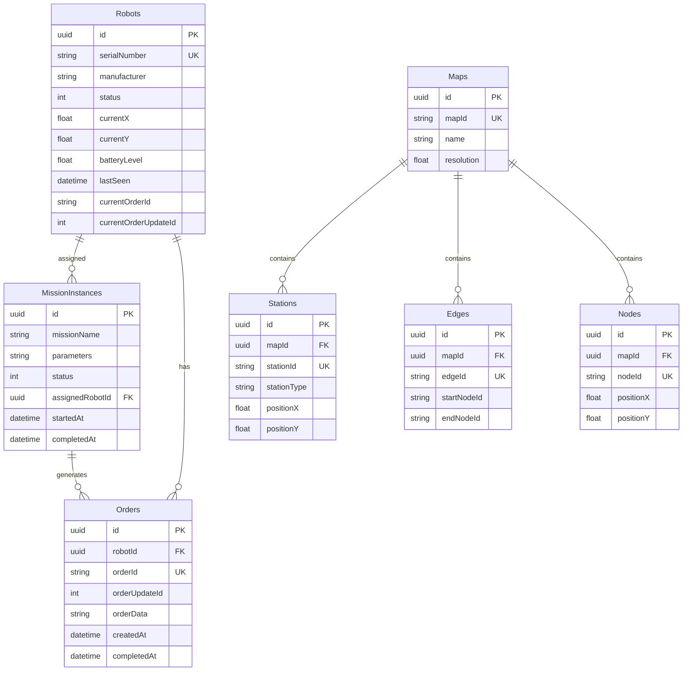

**Lưu ý về State Management**:
- FleetManager chỉ quản lý state hiện tại của robot, không lưu state history
- State được cập nhật real-time từ VDA 5050 state messages
- Khi robot mất kết nối, FleetManager dựa vào thời gian state cuối cùng để quyết định timeout cho order

### Data Flow

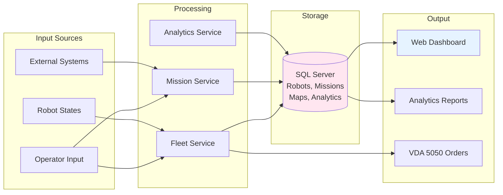

## Design Principles / Nguyên tắc Thiết kế

### 1. Scalability / Khả năng Mở rộng

**Mục tiêu**: Hỗ trợ 100+ robot đồng thời

**Thiết kế**:
- Stateless service design (không lưu state trong memory)
- Asynchronous processing (async/await)
- Efficient database queries (indexes, pagination)
- MQTT broker clustering support (nếu cần)

### 2. Reliability / Độ Tin cậy

**Mục tiêu**: Hệ thống không được gián đoạn

**Thiết kế**:
- MQTT QoS levels phù hợp (QoS 1 cho orders)
- Auto-reconnection logic
- Graceful degradation (degraded mode khi có lỗi)
- Comprehensive error handling
- Safety monitoring (emergency stop < 50ms)

### 3. Real-time Performance / Hiệu năng Real-time

**Yêu cầu**:
- State processing: < 50ms per robot state
- Order generation: < 100ms
- Conflict detection: < 500ms
- Dashboard update: < 100ms (via SignalR)

**Thiết kế**:
- SignalR for real-time updates
- Efficient state processing pipeline
- Background workers for heavy tasks
- Caching frequently accessed data

### 4. Interoperability / Khả năng Tương tác

**Mục tiêu**: Tương thích với hệ thống bên thứ 3

**Thiết kế**:
- Tuân thủ nghiêm ngặt VDA 5050 v2.1.0 (tương thích ngược với v2.0.0)
- Standard MQTT protocol
- REST API for external integration (planned)
- JSON message format (camelCase)

## Security Architecture / Kiến trúc Bảo mật

```mermaid
graph TB
    subgraph "Network Security"
        TLS[MQTT over TLS/SSL]
        Cert[Certificate-based Authentication]
        Firewall[Network Segmentation]
    end
    
    subgraph "Application Security"
        Auth[User Authentication<br/>ASP.NET Identity]
        RBAC[Role-based Access Control<br/>Admin/Operator/Viewer]
        Encrypt[Encrypted Credentials]
        Audit[Audit Logging]
    end
    
    subgraph "Data Security"
        DBEncrypt[Database Encryption]
        Backup[Backup & Recovery]
        Access[Access Control]
    end
    
    TLS --> Auth
    Cert --> Auth
    Auth --> RBAC
    RBAC --> Access
    Access --> DBEncrypt
    DBEncrypt --> Backup
    
    style TLS fill:#ffe6e6
    style Auth fill:#e6ffe6
    style DBEncrypt fill:#e6f3ff
```

## Performance Requirements / Yêu cầu Hiệu năng

| Chỉ số | Mục tiêu | Ghi chú |
|--------|----------|---------|
| **Max Robots** | 100+ | Per FleetManager instance |
| **State Processing** | < 50ms | Per robot state message |
| **Order Generation** | < 100ms | From mission to VDA 5050 order |
| **Conflict Detection** | < 500ms | Multi-robot conflict check |
| **Route Optimization** | < 2 seconds | A* pathfinding |
| **Dashboard Update** | < 100ms | Via SignalR real-time |
| **Database Query** | < 200ms | Average response time |

## ScriptEngine Integration / Tích hợp ScriptEngine

**Mục đích**: Cho phép tùy chỉnh logic mission planning và tích hợp hệ thống bên ngoài.

**FleetManager Script APIs**:

ScriptEngine trong FleetManager expose các APIs thông qua `FleetScriptGlobals`:

```csharp
// Robot Management
Robot GetRobotById(string robotId);
Robot GetRobotBySerial(string serialNumber);
List<Robot> GetAvailableRobots();

// Order Creation (tự động tìm route và tạo order)
Task MoveToNode(string robotSerial, string nodeId);
Task MoveToStation(string robotSerial, string stationId);

// Robot State
RobotState GetRobotState(string robotSerial);

// External System Integration
// Có thể khai báo kết nối với:
// - HTTP APIs
// - Modbus TCP
// - OPC UA
// - CcLink
// - ProfileNet
// - MQTT (external)
```

**Mission và Task trong FleetManager**:

- **Mission**: Methods có `[Mission]` attribute trong script, được ScriptEngine extract và tạo thành MissionInstance
- **Task**: Methods có `[Task]` attribute, chạy lặp lại theo interval
- Mission và Task có thể tương tác qua common APIs:
  - `EnableTask(string taskName)` / `DisableTask(string taskName)`
  - `CreateMission(string missionName, params)` / `CancelMission(Guid missionId)`

**Luồng Mission Execution**:

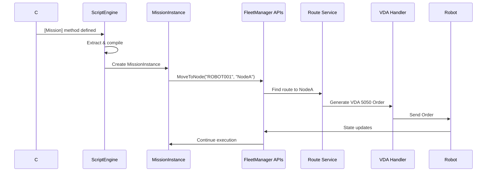

## Deployment Architecture / Kiến trúc Triển khai

**Deployment Model**:
- **Single Instance**: FleetManager chạy một instance duy nhất, có thể điều phối nhiều robot (100+)
- **Không hỗ trợ multiple instances**: FleetManager không chạy multiple instances để share workload

**Infrastructure**:

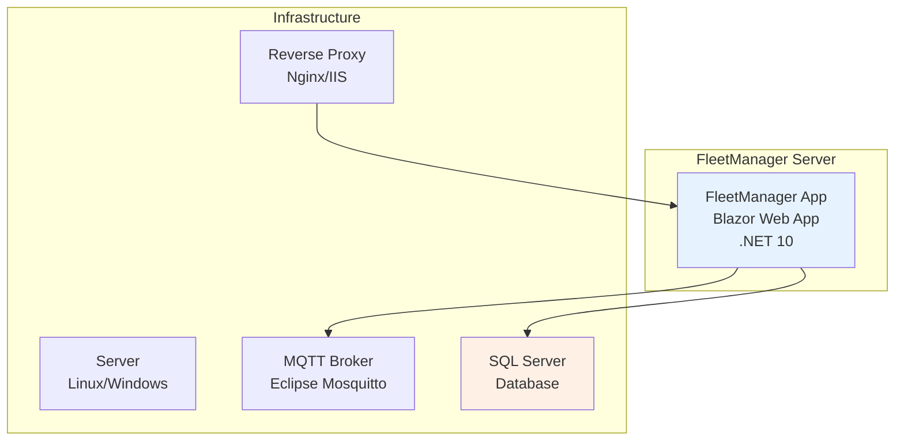

## Related Documents / Tài liệu Liên quan

- [Architecture Overview](../architecture/README.md) - System architecture overview
- [RobotApp Documentation](../robotapp/README.md) - Robot-side application
- [VDA 5050 Implementation](../vda5050/README.md) - Protocol details
- [MapEditor Documentation](../MapEditor/README.md) - Map management
- [ScriptEngine Documentation](../ScriptEngine/README.md) - Custom scripting
- [Development Guide](../development/README.md) - Implementation details

---

**Status**: Architecture & Design Document
**Focus**: System Architecture, Design Concepts, Component Interactions
**Last Updated**: 2025-11-13
**Version**: 2.2 (Updated with 7 core modules structure)
