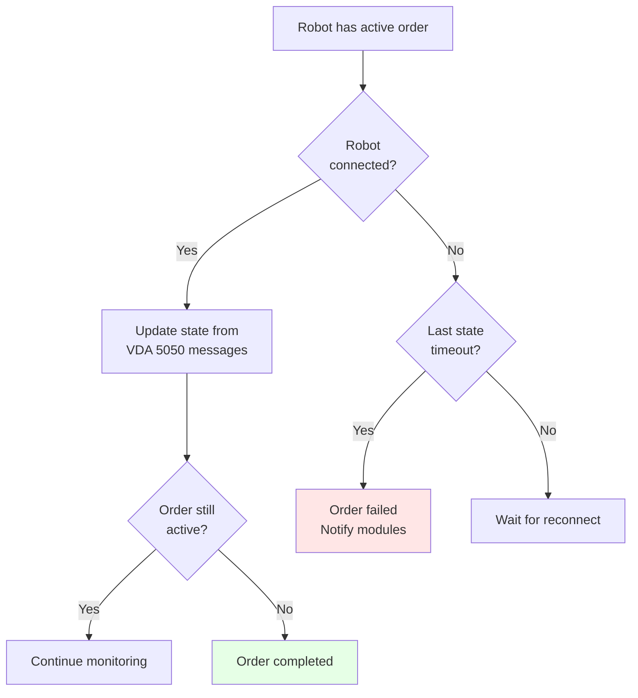

# RobotManager Module / Module Quản lý Robot

## Overview / Tổng quan

RobotManager Module quản lý state, order, và action của robots, cung cấp APIs cho các module khác và ScriptEngine.

## Mục đích / Purpose

Quản lý toàn bộ thông tin về robots bao gồm state hiện tại, orders đang thực hiện, và actions.

## Chức năng chính / Main Features

### 1. State Management / Quản lý Trạng thái

- Quản lý state mới nhất mà robot gửi lên (không lưu history)
- Cập nhật state real-time từ VDA 5050 state messages
- Expose state cho các module khác (TrafficControl, ScriptEngine)

### 2. Order Management / Quản lý Order

- Quản lý orders đã yêu cầu xuống robot
- Quản lý orders đang thực hiện
- Order timeout handling → order failed
- Quản lý order theo từng robot

### 3. Action Management / Quản lý Action

- Quản lý instant actions đã gửi
- Quản lý actions đang thực hiện
- Track action status

## Order Timeout Handling / Xử lý Timeout Order

## APIs cho ScriptEngine

RobotManager expose các APIs cho ScriptEngine thông qua `FleetScriptGlobals`:

- `GetRobotById(string robotId)`: Lấy thông tin robot
- `GetRobotBySerial(string serialNumber)`: Lấy robot theo serial number
- `GetAvailableRobots()`: Lấy danh sách robot available
- `GetRobotState(string robotSerial)`: Lấy state hiện tại của robot
- `MoveToNode(string robotSerial, string nodeId)`: Tạo order di chuyển đến node
- `MoveToStation(string robotSerial, string stationId)`: Tạo order di chuyển đến station

## Integration với RobotConnections

- Nhận thông báo từ RobotConnections về connection status
- Xử lý order timeout dựa trên connection status và last state timestamp

## 📡 VDA 5050 Protocol Handler

RobotManager cũng xử lý VDA 5050 protocol:
- Order Generation: Tạo VDA 5050 orders từ TrafficControl
- Order Updates: Tạo OrderUpdate khi TrafficControl yêu cầu
- State Processing: Xử lý state messages từ robots
- Action Generation: Tạo instant actions

## Related Documents / Tài liệu Liên quan

- [FleetManager Overview](README.md) - Tổng quan FleetManager
- [RobotConnections Module](RobotConnections.md) - Cung cấp connection status
- [TrafficControl Module](TrafficControl.md) - Sử dụng RobotManager để check robot state
- [ScriptEngine Module](ScriptEngine.md) - Sử dụng RobotManager APIs
- [VDA 5050 Integration](../vda5050/README.md) - Chi tiết về VDA 5050 protocol

---

**Last Updated**: 2025-11-13

