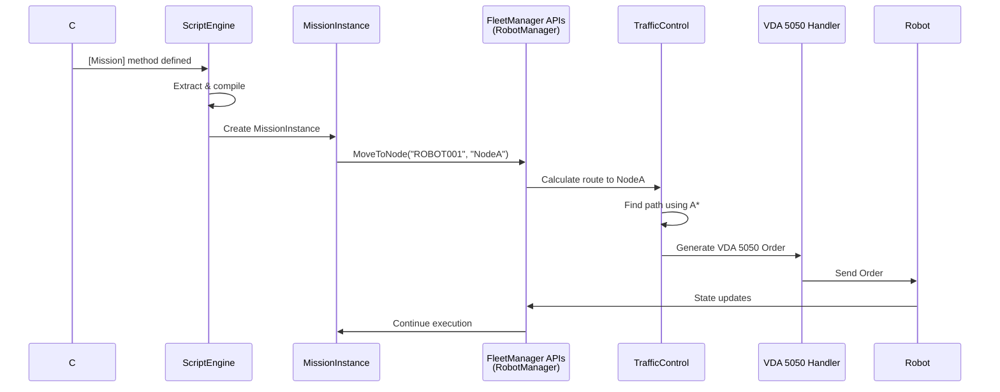

# ScriptEngine Module / Module Script Engine

## Overview / Tổng quan

ScriptEngine Module quản lý script do người dùng thiết kế, chạy Task và Mission để tùy chỉnh logic của FleetManager.

## Mục đích / Purpose

Cho phép người dùng viết C# scripts để tùy chỉnh mission planning, tích hợp hệ thống bên ngoài, và tự động hóa các tác vụ.

## Kiến trúc / Architecture

- **Shared Library**: ScriptEngine là shared library cho FleetManager và RobotApp
- **Implementation**: FleetManager và RobotApp implement `IScriptResource` để cung cấp Type mô tả và object cho API mở rộng
- **Components**:
  - C# Library: Script compilation, execution, state machine
  - Blazor Library: Monaco Editor component với IntelliSense

## Chức năng chính / Main Features

### 1. Script File Management / Quản lý File Script

- Quản lý script files bằng file system
- Backup và restore scripts (ZIP format)
- File locking qua SignalR (khi user đang edit, các session khác không được sửa)

### 2. Script Compilation / Biên dịch Script

- Compile C# scripts với Roslyn
- Extract Mission methods (có `[Mission]` attribute)
- Extract Task methods (có `[Task]` attribute)
- Extract Variables (có `[Variable]` attribute)

### 3. Mission và Task Execution / Thực thi Mission và Task

- MissionInstance execution: Chạy Mission methods với progress tracking
- Task execution: Chạy Task methods theo interval (periodic)
- State machine: Idle → Building → Ready → Running

### 4. IntelliSense Support / Hỗ trợ IntelliSense

- Sử dụng AdhocWorkspace trên WebAssembly
- IntelliSense, Hover information, Diagnostics
- Real-time code analysis

## FleetManager Script APIs

FleetManager implement `IScriptResource` để expose APIs cho scripts:

```csharp
public class FleetScriptGlobals
{
    // Robot Management
    Robot GetRobotById(string robotId);
    Robot GetRobotBySerial(string serialNumber);
    List<Robot> GetAvailableRobots();
    
    // Order Creation (tự động tìm route và tạo order)
    Task MoveToNode(string robotSerial, string nodeId);
    Task MoveToStation(string robotSerial, string stationId);
    
    // Robot State
    RobotState GetRobotState(string robotSerial);
    
    // External System Integration
    // Có thể khai báo kết nối với:
    // - HTTP APIs
    // - Modbus TCP
    // - OPC UA
    // - CcLink
    // - ProfileNet
    // - MQTT (external)
}
```

## Mission và Task trong ScriptEngine

- **Mission**: Methods có `[Mission]` attribute, được extract và tạo thành MissionInstance
- **Task**: Methods có `[Task]` attribute, chạy lặp lại theo interval
- Mission và Task có thể tương tác qua common APIs:
  - `EnableTask(string taskName)` / `DisableTask(string taskName)`
  - `CreateMission(string missionName, params)` / `CancelMission(Guid missionId)`

## Luồng Mission Execution / Mission Execution Flow



## Related Documents / Tài liệu Liên quan

- [FleetManager Overview](README.md) - Tổng quan FleetManager
- [RobotManager Module](RobotManager.md) - Cung cấp APIs cho ScriptEngine
- [TrafficControl Module](TrafficControl.md) - Được gọi từ ScriptEngine để tính toán routes
- [ScriptEngine Documentation](../ScriptEngine/README.md) - Chi tiết về ScriptEngine shared library

---

**Last Updated**: 2025-11-13

