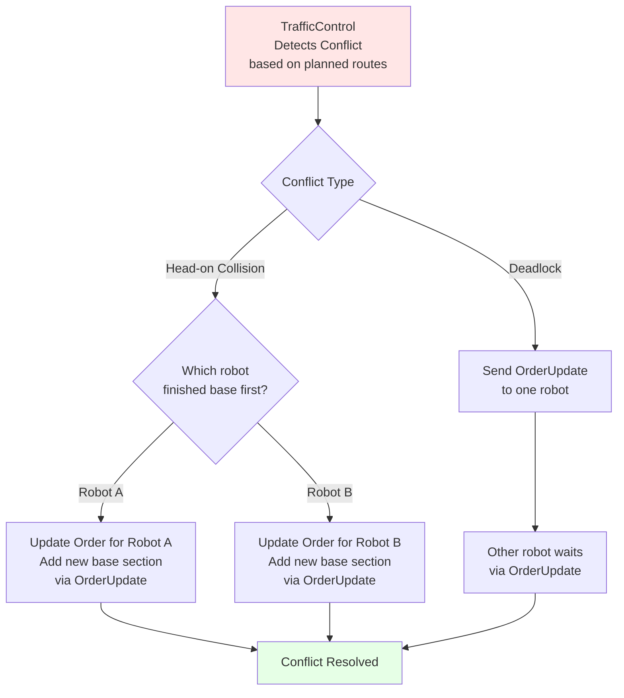
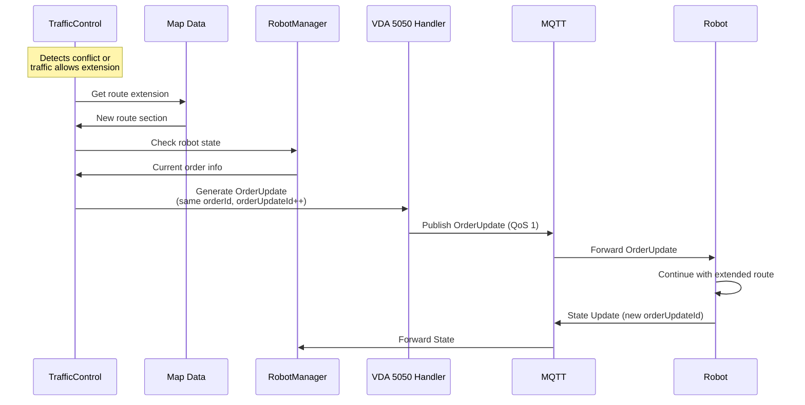

# TrafficControl Module / Module Điều khiển Giao thông

## Overview / Tổng quan

TrafficControl Module tính toán route cho order, phát hiện conflict và đưa tuyến đường mới để giải quyết xung đột giữa các robot.

## Mục đích / Purpose

- Tính toán route tối ưu cho robot orders
- Phát hiện và giải quyết conflicts giữa các robot
- Quản lý base và horizon của VDA 5050 orders

## Chức năng chính / Main Features

### 1. Route Calculation / Tính toán Tuyến đường

- Tính toán route giữa hai nodes/stations
- Sử dụng A* algorithm trên map data từ MapEditor
- Đọc map data từ SQL Server database
- Tạo VDA 5050 order structure với nodes và edges

### 2. Base và Horizon Management

- **Base**: Phần order đã được release và robot đang thực hiện
- **Horizon**: Phần order chưa được release, đang chờ điều kiện
- Monitor traffic trên map
- Quyết định khi nào release thêm nodes/edges vào order
- Update `orderUpdateId` khi release thêm phần horizon

### 3. Conflict Detection / Phát hiện Xung đột

- Dựa trên **planned routes** của các robot
- Phát hiện head-on collisions
- Phát hiện deadlock situations
- Phát hiện resource conflicts

### 4. Conflict Resolution / Giải quyết Xung đột

- Sử dụng OrderUpdate để tạo tuyến đường mới cho một robot
- Deadlock resolution: Một robot đợi robot khác đi qua
- Robot nào hoàn thành phần base trước sẽ được đăng ký thêm phần base tiếp theo

## Conflict Resolution Flow / Luồng Giải quyết Xung đột

## 📡 OrderUpdate Flow / Luồng OrderUpdate

## Related Documents / Tài liệu Liên quan

- [FleetManager Overview](README.md) - Tổng quan FleetManager
- [MapEditor Module](MapEditor.md) - Cung cấp map data cho route calculation
- [RobotManager Module](RobotManager.md) - Cung cấp robot state để check conflicts
- [VDA 5050 Integration](../vda5050/README.md) - Chi tiết về OrderUpdate mechanism

---

**Last Updated**: 2025-11-13

