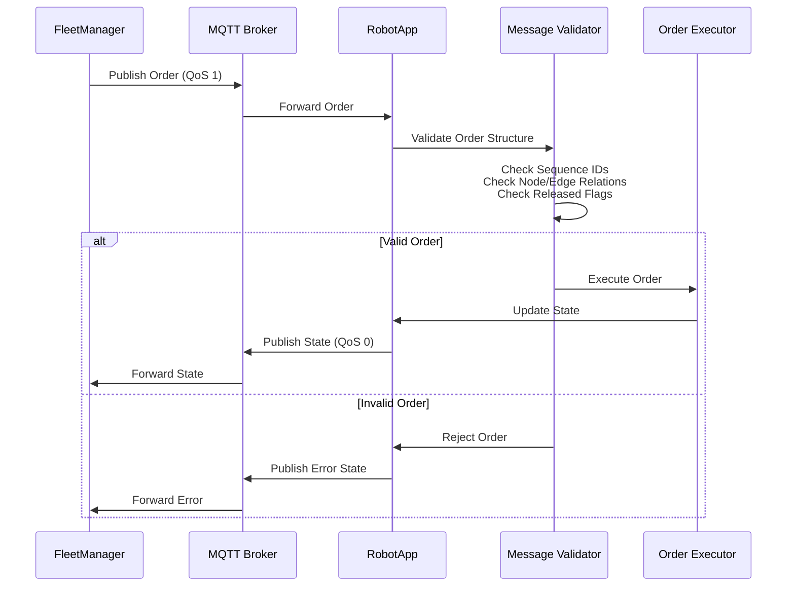
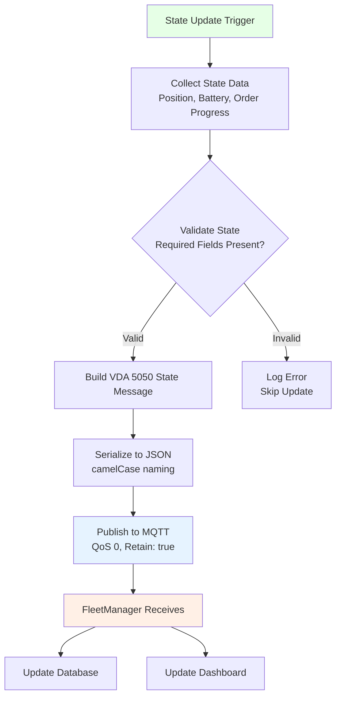
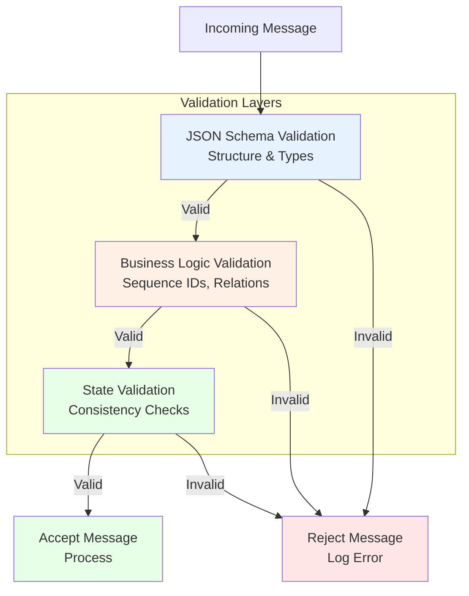
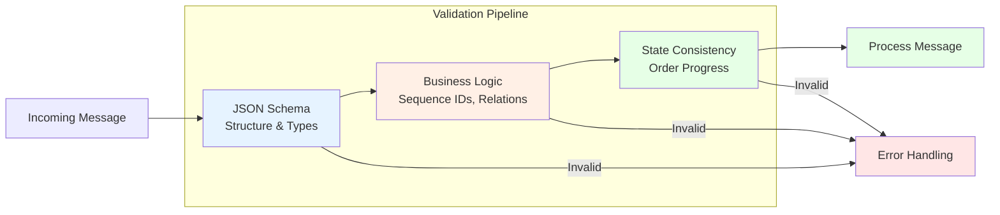
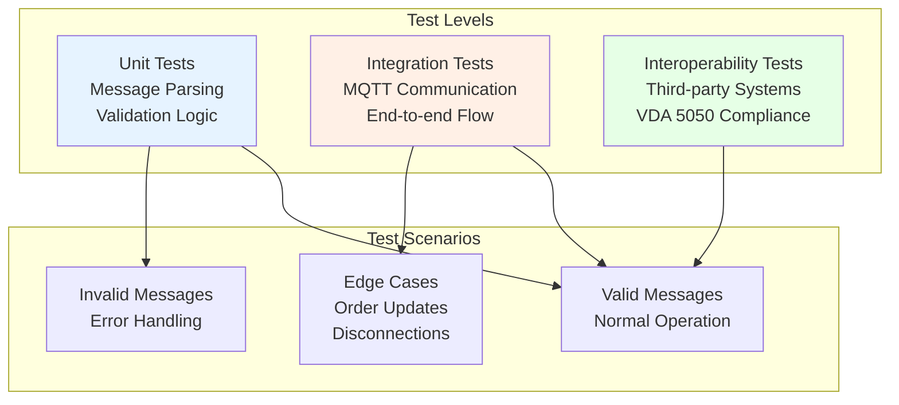
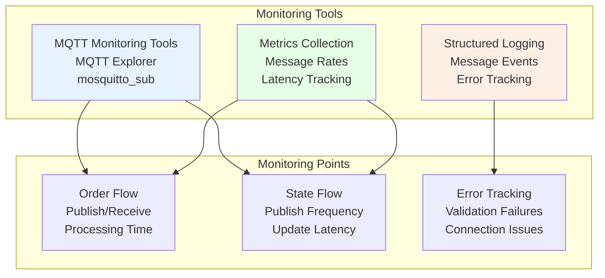

# VDA 5050 Integration Guide / Hướng dẫn Tích hợp VDA 5050

## Overview / Tổng quan

VDA 5050 là tiêu chuẩn quốc tế cho giao tiếp giữa Fleet Management System và AGV/AMR. Tài liệu này mô tả cách RobotNet10 triển khai tiêu chuẩn này.

## Why VDA 5050? / Tại sao VDA 5050?

### Lợi ích / Benefits

1. **Interoperability** - Khả năng tương tác
   - Robot của RobotNet10 có thể hoạt động với Fleet Manager của hãng khác
   - FleetManager của RobotNet10 có thể quản lý robot của hãng khác

2. **Standardization** - Chuẩn hóa
   - Định nghĩa rõ ràng message formats
   - Behavior được mô tả chi tiết
   - Giảm thiểu hiểu lầm trong implementation

3. **Industry Adoption** - Được công nghiệp chấp nhận
   - Nhiều nhà sản xuất robot hỗ trợ
   - Nhiều Fleet Management System hỗ trợ
   - Community support và tài liệu phong phú

## What's New in VDA 5050 2.1.0 / Tính năng Mới trong 2.1.0

### Key Features / Tính năng Chính

1. **Corridors (Hành lang di chuyển)**
   - Cho phép robot di chuyển trong các hành lang xác định
   - Tăng tính linh hoạt trong navigation
   - Tránh chướng ngại vật một cách tự động
   - Đặc biệt hữu ích cho các robot có mức độ tự động hóa cao

2. **Map Distribution & Management (Phân phối và Quản lý Bản đồ)**
   - Chuẩn hóa quy trình cập nhật và quản lý bản đồ
   - Tải, kích hoạt và quản lý bản đồ điều hướng trên robot
   - Hỗ trợ map versioning và updates

3. **Improved Documentation (Tài liệu Cải thiện)**
   - Hình minh họa được cập nhật, dễ hiểu hơn
   - Loại bỏ các điểm không rõ ràng
   - Phát hành hoàn toàn bằng tiếng Anh (Single Point of Truth)

4. **Backward Compatibility (Tương thích Ngược)**
   - Tương thích với version 2.0.0
   - Các hệ thống hiện có có thể nng cấp mà không gặp vấn đề

### Implementation Notes / Ghi chú Triển khai

**For RobotNet10**:
- RobotNet10 sẽ implement VDA 5050 2.1.0 với đầy đủ tính năng mới
- Corridors sẽ được tích hợp vào TrafficControl module để tăng tính linh hoạt navigation
- Map Distribution & Management sẽ được tích hợp với MapEditor module
- Tương thích ngược đảm bảo có thể làm việc với robot/hệ thống v2.0.0

**Note**: Chi tiết implementation của Corridors và Map Distribution sẽ được cập nhật trong các module documentation khi triển khai.

## VDA 5050 Standard Overview / Tổng quan Tiêu chuẩn

### Version Information
- **Current Implementation**: VDA 5050 Version 2.1.0
- **Release Date**: January 2025
- **Standard Body**: VDA (Verband der Automobilindustrie)
- **Backward Compatibility**: Compatible with version 2.0.0
- **Language**: English (first fully English release)

### Key Concepts

**AGV (Automated Guided Vehicle) / AMR (Autonomous Mobile Robot)**
- Robot di động tự động
- Nhận lệnh từ Master Control (Fleet Manager)
- Báo cáo trạng thái về Master Control

**Master Control (Fleet Manager)**
- Hệ thống điều phối robot
- Gửi orders đến robot
- Nhận state từ robot

**Order**
- Nhiệm vụ được gửi đến robot
- Bao gồm nodes (điểm đến) và edges (đường đi)
- Có thể chứa actions (hành động tại các node)

**State**
- Trạng thái hiện tại của robot
- Được gửi định kỳ và khi có thay đổi
- Bao gồm vị trí, battery, errors, etc.

## Message Types / Các Loại Message

### 1. Order (Master Control → AGV)

**Purpose**: Gửi nhiệm vụ đến robot

**Direction**: FleetManager → RobotApp

**Topic**: `uagv/v2/{manufacturer}/{serialNumber}/order`

**Structure**:
```json
{
  "headerId": 0,
  "timestamp": "2025-11-12T10:30:00Z",
  "version": "2.1.0",
  "manufacturer": "RobotNet10",
  "serialNumber": "ROBOT001",
  "orderId": "ORDER-12345",
  "orderUpdateId": 0,
  "nodes": [
    {
      "nodeId": "node1",
      "sequenceId": 0,
      "released": true,
      "nodeDescription": "Pick location",
      "nodePosition": {
        "x": 10.5,
        "y": 20.3,
        "theta": 0.0,
        "allowedDeviationXY": 0.5,
        "allowedDeviationTheta": 0.1,
        "mapId": "factory_floor_1",
        "mapDescription": "Factory Floor 1"
      },
      "actions": [
        {
          "actionType": "pick",
          "actionId": "action1",
          "actionDescription": "Pick pallet",
          "blockingType": "HARD",
          "actionParameters": [
            {
              "key": "stationType",
              "value": "floor"
            }
          ]
        }
      ]
    },
    {
      "nodeId": "node2",
      "sequenceId": 2,
      "released": true,
      "nodePosition": {
        "x": 50.0,
        "y": 30.0,
        "theta": 1.57,
        "mapId": "factory_floor_1"
      },
      "actions": [
        {
          "actionType": "drop",
          "actionId": "action2",
          "blockingType": "HARD"
        }
      ]
    }
  ],
  "edges": [
    {
      "edgeId": "edge1",
      "sequenceId": 1,
      "released": true,
      "startNodeId": "node1",
      "endNodeId": "node2",
      "maxSpeed": 1.5,
      "maxHeight": 2.0,
      "minHeight": 0.0,
      "orientation": 0.0,
      "direction": "forward",
      "rotationAllowed": true,
      "maxRotationSpeed": 0.5,
      "trajectory": {
        "degree": 1,
        "knotVector": [0, 1],
        "controlPoints": [
          {"x": 10.5, "y": 20.3, "weight": 1.0},
          {"x": 50.0, "y": 30.0, "weight": 1.0}
        ]
      },
      "actions": []
    }
  ]
}
```

**Key Fields**:
- `orderId`: Unique order identifier
- `orderUpdateId`: Increments when order is updated
- `nodes`: Array of waypoints
- `edges`: Array of paths between nodes
- `sequenceId`: Determines execution order (even for nodes, odd for edges)

### 2. InstantActions (Master Control → AGV)

**Purpose**: Gửi lệnh ngay lập tức (stop, pause, etc.)

**Direction**: FleetManager → RobotApp

**Topic**: `uagv/v2/{manufacturer}/{serialNumber}/instantActions`

**Structure**:
```json
{
  "headerId": 1,
  "timestamp": "2025-11-12T10:31:00Z",
  "version": "2.1.0",
  "manufacturer": "RobotNet10",
  "serialNumber": "ROBOT001",
  "instantActions": [
    {
      "actionType": "stopPause",
      "actionId": "instant1",
      "actionDescription": "Emergency pause",
      "blockingType": "HARD"
    }
  ]
}
```

**Common InstantAction Types**:
- `stopPause`: Pause robot immediately
- `cancelOrder`: Cancel current order
- `initPosition`: Set initial position
- `stateRequest`: Request state update

### 3. State (AGV → Master Control)

**Purpose**: Báo cáo trạng thái robot

**Direction**: RobotApp → FleetManager

**Topic**: `uagv/v2/{manufacturer}/{serialNumber}/state`

**Structure**:
```json
{
  "headerId": 100,
  "timestamp": "2025-11-12T10:30:05Z",
  "version": "2.1.0",
  "manufacturer": "RobotNet10",
  "serialNumber": "ROBOT001",
  "orderId": "ORDER-12345",
  "orderUpdateId": 0,
  "zoneSetId": "zone1",
  "lastNodeId": "node1",
  "lastNodeSequenceId": 0,
  "driving": true,
  "paused": false,
  "newBaseRequest": false,
  "distanceSinceLastNode": 2.5,
  "operatingMode": "AUTOMATIC",
  "nodeStates": [
    {
      "nodeId": "node1",
      "sequenceId": 0,
      "released": true,
      "nodePosition": {
        "x": 10.5,
        "y": 20.3,
        "theta": 0.0,
        "mapId": "factory_floor_1"
      }
    }
  ],
  "edgeStates": [
    {
      "edgeId": "edge1",
      "sequenceId": 1,
      "released": true,
      "trajectory": {}
    }
  ],
  "actionStates": [
    {
      "actionId": "action1",
      "actionType": "pick",
      "actionStatus": "FINISHED",
      "resultDescription": "Successfully picked pallet"
    }
  ],
  "agvPosition": {
    "x": 15.2,
    "y": 22.1,
    "theta": 0.15,
    "mapId": "factory_floor_1",
    "positionInitialized": true,
    "localizationScore": 0.95,
    "deviationRange": 0.1
  },
  "velocity": {
    "vx": 1.0,
    "vy": 0.0,
    "omega": 0.05
  },
  "loads": [
    {
      "loadId": "pallet123",
      "loadType": "EPAL",
      "loadPosition": "front",
      "boundingBoxReference": {
        "x": 0.0,
        "y": 0.0,
        "z": 0.0,
        "theta": 0.0
      },
      "loadDimensions": {
        "length": 1.2,
        "width": 0.8,
        "height": 1.5
      },
      "weight": 500.0
    }
  ],
  "batteryState": {
    "batteryCharge": 75.5,
    "batteryVoltage": 48.2,
    "batteryHealth": 95.0,
    "charging": false,
    "reach": 5400
  },
  "errors": [
    {
      "errorType": "warning",
      "errorLevel": "WARNING",
      "errorDescription": "Battery below 80%",
      "errorReferences": [
        {
          "referenceKey": "batteryLevel",
          "referenceValue": "75.5"
        }
      ]
    }
  ],
  "information": [
    {
      "infoType": "info",
      "infoLevel": "INFO",
      "infoDescription": "Mission in progress",
      "infoReferences": []
    }
  ],
  "safetyState": {
    "eStop": "NONE",
    "fieldViolation": false
  }
}
```

**Key State Information**:
- **Position**: Current robot position and velocity
- **Order Progress**: Which node/edge is active
- **Battery**: Charge level and charging status
- **Actions**: Status of actions (WAITING, RUNNING, FINISHED, FAILED)
- **Errors**: Any errors or warnings
- **Safety**: E-stop and safety field status

### 4. Visualization (AGV → Master Control)

**Purpose**: Gửi dữ liệu để hiển thị trên bản đồ

**Direction**: RobotApp → FleetManager

**Topic**: `uagv/v2/{manufacturer}/{serialNumber}/visualization`

**Structure**:
```json
{
  "headerId": 200,
  "timestamp": "2025-11-12T10:30:05Z",
  "version": "2.1.0",
  "manufacturer": "RobotNet10",
  "serialNumber": "ROBOT001",
  "agvPosition": {
    "x": 15.2,
    "y": 22.1,
    "theta": 0.15,
    "mapId": "factory_floor_1",
    "positionInitialized": true
  },
  "velocity": {
    "vx": 1.0,
    "vy": 0.0,
    "omega": 0.05
  }
}
```

### 5. Connection (Bidirectional)

**Purpose**: Heartbeat và connection status

**Direction**: Bidirectional

**Topics**:
- `uagv/v2/{manufacturer}/{serialNumber}/connection`

**Structure**:
```json
{
  "headerId": 300,
  "timestamp": "2025-11-12T10:30:00Z",
  "version": "2.1.0",
  "manufacturer": "RobotNet10",
  "serialNumber": "ROBOT001",
  "connectionState": "ONLINE"
}
```

**Connection States**:
- `ONLINE`: Connected and operational
- `OFFLINE`: Disconnected
- `CONNECTIONBROKEN`: Connection lost unexpectedly

## MQTT Configuration / Cấu hình MQTT

### QoS Levels

| Message Type | QoS | Reason |
|--------------|-----|--------|
| Order | 1 | At least once delivery |
| InstantActions | 1 | At least once delivery |
| State | 0 | High frequency, latest value matters |
| Visualization | 0 | High frequency, latest value matters |
| Connection | 1 | Reliable delivery needed |

### Retain Flag

| Message Type | Retain | Reason |
|--------------|--------|--------|
| Order | false | Order-specific |
| InstantActions | false | Time-sensitive |
| State | true | Latest state available for new subscribers |
| Visualization | false | Real-time only |
| Connection | true | Connection status for new subscribers |

### Topic Wildcards

**FleetManager subscribes to all robots**:
```
uagv/v2/RobotNet10/+/state
uagv/v2/RobotNet10/+/visualization
uagv/v2/RobotNet10/+/connection
```

**RobotApp subscribes to its own topics**:
```
uagv/v2/RobotNet10/ROBOT001/order
uagv/v2/RobotNet10/ROBOT001/instantActions
```

## Architecture & Design / Kiến trúc & Thiết kế

### Message Flow Architecture

```mermaid
graph TB
    subgraph "FleetManager"
        OrderGen[Order Generator<br/>Create VDA 5050 Orders]
        StateProc[State Processor<br/>Process Robot States]
        ActionGen[Action Generator<br/>Generate Instant Actions]
    end
    
    subgraph "MQTT Broker"
        OrderTopic[Order Topics<br/>uagv/v2/{mfr}/{serial}/order]
        StateTopic[State Topics<br/>uagv/v2/{mfr}/{serial}/state]
        InstantTopic[Instant Action Topics<br/>uagv/v2/{mfr}/{serial}/instantActions]
    end
    
    subgraph "RobotApp"
        OrderHandler[Order Handler<br/>Process Orders]
        StatePub[State Publisher<br/>Publish States]
        InstantHandler[Instant Action Handler<br/>Process Immediate Commands]
    end
    
    OrderGen --> OrderTopic
    OrderTopic --> OrderHandler
    
    StatePub --> StateTopic
    StateTopic --> StateProc
    
    ActionGen --> InstantTopic
    InstantTopic --> InstantHandler
    
    style OrderGen fill:#e6f3ff
    style StateProc fill:#fff0e6
    style OrderHandler fill:#e6ffe6
    style StatePub fill:#e6ffe6
```

### Message Processing Flow

**Order Processing**:



**State Publishing**:



### Message Validation Architecture



## ✅ Validation & Testing / Kiểm tra & Test

### Message Validation Strategy

**Validation Layers**:



**Validation Checks**:

1. **JSON Schema Validation**:
   - Use official VDA 5050 JSON schemas
   - Validate structure and data types
   - Check required fields

2. **Business Logic Validation**:
   - Sequence IDs: Nodes (even), Edges (odd), sequential
   - Node/Edge relationships: Edges connect nodes properly
   - Released flags: Valid release sequence
   - Order updates: orderUpdateId increments correctly

3. **State Consistency Validation**:
   - Order progress matches current order
   - Position matches mapId
   - Action states match order actions

### Testing Strategy

**Testing Approach**:



**Key Test Scenarios**:

1. **Order Handling**:
   - Valid order acceptance
   - Invalid order rejection
   - Order update handling (same orderId, higher orderUpdateId)
   - Order replacement (new orderId)
   - Sequence ID ordering
   - Released vs unreleased nodes/edges

2. **State Reporting**:
   - Publishing frequency (1-10 Hz)
   - Required fields present
   - Position accuracy
   - Battery state correctness
   - Action state updates
   - Error reporting

3. **Instant Actions**:
   - stopPause immediate response (< 50ms)
   - cancelOrder order cancellation
   - Resume after pause

4. **Connection Management**:
   - MQTT disconnection handling
   - Auto-reconnection
   - Missed message handling
   - Connection state reporting

5. **Interoperability**:
   - Third-party Fleet Manager compatibility
   - Third-party robot compatibility
   - VDA 5050 conformance validation

## Monitoring & Debugging / Giám sát & Debug

### Monitoring Architecture



### Monitoring Strategy

**MQTT Monitoring**:
- Use MQTT Explorer GUI tool để view topics
- Monitor message flow với `mosquitto_sub`
- Track message rates và latency

**Logging Approach**:
- Structured logging với parameters
- Log message events (receive, publish)
- Track validation failures
- Monitor connection status

**Key Metrics**:
- Message processing time
- State update frequency
- Error rates
- Connection stability

## Common Scenarios / Các Tình huống Thường gặp

### Scenario 1: Simple Transport Mission

**FleetManager sends**:
```json
{
  "orderId": "TRANSPORT-001",
  "orderUpdateId": 0,
  "nodes": [
    {"nodeId": "A", "sequenceId": 0, "released": true, "nodePosition": {...}},
    {"nodeId": "B", "sequenceId": 2, "released": true, "nodePosition": {...}}
  ],
  "edges": [
    {"edgeId": "A-B", "sequenceId": 1, "released": true,
     "startNodeId": "A", "endNodeId": "B"}
  ]
}
```

**RobotApp executes**:
1. Receives order
2. Moves to node A (sequenceId 0)
3. Reaches node A, updates state (lastNodeId = "A", lastNodeSequenceId = 0)
4. Follows edge A-B (sequenceId 1)
5. Reaches node B (sequenceId 2)
6. Updates state (lastNodeId = "B", lastNodeSequenceId = 2, driving = false)

### Scenario 2: Pick and Place with Actions

**FleetManager sends**:
```json
{
  "orderId": "PICK-PLACE-001",
  "orderUpdateId": 0,
  "nodes": [
    {
      "nodeId": "PICK",
      "sequenceId": 0,
      "released": true,
      "actions": [
        {"actionId": "pick1", "actionType": "pick", "blockingType": "HARD"}
      ]
    },
    {
      "nodeId": "DROP",
      "sequenceId": 2,
      "released": true,
      "actions": [
        {"actionId": "drop1", "actionType": "drop", "blockingType": "HARD"}
      ]
    }
  ],
  "edges": [...]
}
```

**RobotApp executes**:
1. Moves to PICK node
2. Executes pick action (actionStates: RUNNING → FINISHED)
3. Moves to DROP node
4. Executes drop action
5. Reports completion

### Scenario 3: Order Update (Add Waypoint)

**Initial order**:
```json
{"orderId": "ORD-001", "orderUpdateId": 0, "nodes": ["A", "B"]}
```

**Updated order** (add node C):
```json
{"orderId": "ORD-001", "orderUpdateId": 1, "nodes": ["A", "B", "C"]}
```

**RobotApp behavior**:
- Recognize same orderId with higher orderUpdateId
- Continue current node/edge
- Append new nodes to plan
- Update state with new orderUpdateId

### Scenario 4: Emergency Stop

**FleetManager sends InstantAction**:
```json
{
  "instantActions": [
    {"actionId": "stop1", "actionType": "stopPause", "blockingType": "HARD"}
  ]
}
```

**RobotApp behavior**:
1. Immediately stop motion
2. Set `paused = true` in state
3. Continue publishing state
4. Wait for resume command

## References / Tài liệu Tham khảo

### Official VDA 5050 Resources

- **Specification**: VDA 5050 v2.1.0 (English - first fully English release)
- **JSON Schemas**: Official schemas for validation
- **GitHub**: https://github.com/VDA5050/VDA5050
- **Release Notes**: Check GitHub releases for 2.1.0 changes

### Recommended Reading

1. VDA 5050 Specification Document (Main reference)
2. VDA 5050 FAQ and Best Practices
3. MQTT Protocol Specification v3.1.1 / v5.0
4. JSON Schema Specification

### Community & Support

- VDA 5050 Working Group
- Industrial automation forums
- GitHub discussions

## Related Documents / Tài liệu Liên quan

- [Architecture Overview](../architecture/README.md)
- [RobotApp Implementation](../robotapp/README.md)
- [FleetManager Implementation](../fleetmanager/README.md)
- [MQTT Configuration Guide](mqtt-configuration.md) (TBD)

---

**VDA 5050 Version**: 2.1.0
**Implementation Status**: Design Phase
**Last Updated**: 2025-11-13
**Release Date**: January 2025
